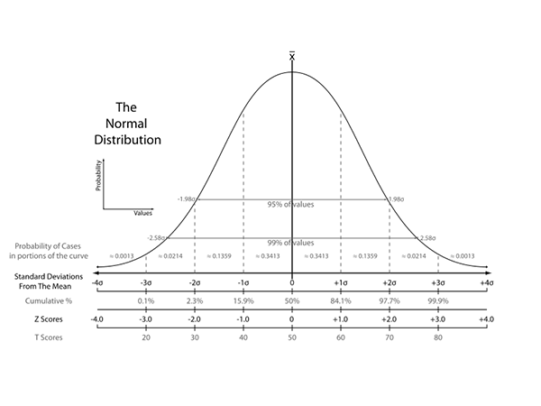

<style type="text/css">
p{ /* Normal  */
   font-size: 12px;
}
body{ /* Normal  */
   font-size: 12px;
}
td {  /* Table  */
   font-size: 10px;
}
h1 { /* Header 1 */
 font-size: 26px;
 color: #4294ce;
}
h2 { /* Header 2 */
 font-size: 22px;
}
h3 { /* Header 3 */
 font-size: 18px;
}
code.r{ /* Code block */
  font-size: 10px;
}
pre { /* Code block */
  font-size: 10px
}
#table-of-contents h2 {
background-color: #4294ce;
}
#table-of-contents{
background: #688FAD;
}
#nav-top span.glyphicon{
color: #4294ce;
}
#postamble{
background: #4294ce;
border-top: ;
}
</style>

```{r echo=FALSE, warning=FALSE, message=FALSE}
if(!require(easypackages)){install.packages("easypackages")}
library(easypackages)
packages("dplyr", "ggplot2","pwr", "bayesAB", prompt = FALSE)
```

# Traditional A/B Testing Methodolgy

To start testing off on the right foot, we need to plan for an A/B test and perform a power calculation. This requires defining a hypothesis and test groups, and then considering two questions.

- How sure do we need to be that we are measuring a real change?
- How big is the change we expect to see because of the new version, compared to the baseline?

What percentage of the time are we willing to miss a real effect? This is measured by power.

What percentage of the time are we willing to be fooled into seeing an effect by random chance? This is called significance level, and more precisely, we would state this as the probability of rejecting the null hypothesis.

Typical statistical standards for these quantities are 80% for power (i.e., 20% chance of a false negative) and 5% for significance level. 

Estimating effect size requires strategic product thinking. 

https://www.r-bloggers.com/from-power-calculations-to-p-values-ab-testing-at-stack-overflow/?utm_source=feedburner&utm_medium=email&utm_campaign=Feed%3A+RBloggers+%28R+bloggers%29

https://juliasilge.shinyapps.io/power-app/

## Hypothesis Testing

The most common type of hypothesis testing involves a null hypothesis. The null hypothesis, denoted H0, is a statement about the world which can plausibly account for the data you observe. Don't read anything into the fact that it's called the "null" hypothesis — it's just the hypothesis we're trying to test.

For example, "the coin is fair" is an example of a null hypothesis, as is "the coin is biased." The important part is that the null hypothesis be able to be expressed in simple, mathematical terms.

The main goal of hypothesis testing is to tell us whether we have enough evidence to reject the null hypothesis. In our case we want to know whether the coin is biased or not, so our null hypothesis should be "the coin is fair." If we get enough evidence that contradicts this hypothesis, say, by flipping it 100 times and having it come up heads only once, then we can safely reject it.

So, we have a coin. Our null hypothesis is that this coin is fair. We flip it 100 times and it comes up heads 51 times. Do we know whether the coin is biased or not?

Our gut might say the coin is fair, or at least probably fair, but we can't say for sure. The expected number of heads is 50 and 51 is quite close. But what if we flipped the coin 100,000 times and it came up heads 51,000 times? We see 51% heads both times, but in the second instance the coin is more likely to be biased.

**Lack of evidence to the contrary is not evidence that the null hypothesis is true**. Rather, it means that we don't have sufficient evidence to conclude that the null hypothesis is false. The coin might actually have a 51% bias towards heads, after all.

If instead we saw 1 head for 100 flips that would be another story. Intuitively we know that the chance of seeing this if the null hypothesis were true is so small that we would be comfortable rejecting the null hypothesis and declaring the coin to (probably) be biased.

We can use whatever level of confidence we want before rejecting the null hypothesis, but most people choose 90%, 95%, or 99%. 

The Central Limit Theorem says that the sum of any number of re-averaged identically distributed random variables approximates a normal distribution.

Here's the normal curve:

 

A 95% level of confidence means we reject the null hypothesis if p falls outside 95% of the area of the normal curve. Looking at that chart we see that this corresponds to approximately 1.98 standard deviations.

The so-called "z-score" tells us how many standard deviations away from the mean our sample is.

Let's say we flipped three coins 100 times each and got the following data.

Data for 100 Flips of a Coin

| Coin	| Flips	Pct. | Heads |	Z-score |
| ----- | ---- | ---- | ---- |
| Coin 1	| 100	| 51%	| 0.20 |
| Coin 2	| 100	| 60%	| 2.04 |
| Coin 3	| 100	| 75%	| 5.77 |

Using a 95% confidence level we'd conclude that Coin 2 and Coin 3 are biased using the techniques we've developed so far. Coin 2 is 2.04 standard deviations from the mean and Coin 3 is 5.77 standard deviations.

When your test statistic meets the 95% confidence threshold we call it statistically significant.

This means there's only a 5% chance of observing what you did assuming the null hypothesis was true. Phrased another way, there's only a 5% chance that your observation is due to random variation.

> Might want to try exploratory.io
https://blog.exploratory.io/an-introduction-to-bayesian-a-b-testing-in-exploratory-cb5a7ad80963

## Example 1

A/B testing is a method for comparing the effectiveness of several different variations of a web page. For example, an online clothing retailer that specializes in mens’ streetwear may want to examine whether a black or pink background results in more purchases from visitors to the site. Lets say that our online store is just a single web page, and we run this experiment by randomly showing one variation (pink background) of the page to half the visitors and the control background to the other half. After running the experiment for one week, we find that the pink background resulted in 40% purchase rate with 500 visitors while the black background resulted in a 30% purchase rate with 550 visitors. So which background is more effective at generating purchases from visitors to the online store. One way to examine this problem is by calculating confidence intervals of the conversion rates for each variation of the site. 

Construct a function which calculates the confidence intervals for the purchase rate of each site at a 80% significance level. 

```{r}
site1 = c(.40, 500) # pink
site2 = c(.30, 550) # black
Zscore = .8

abtestfunc <- function(ad1, ad2, Zscore){
      zVal <- round(qnorm(1 - (1 - Zscore)/2), 2)
      sterror1 = sqrt( ad1[1] * (1-ad1[1]) / ad1[2] )
      sterror2 = sqrt( ad2[1] * (1-ad2[1]) / ad2[2] )
      minmax1 = c((ad1[1] - zVal*sterror1) * 100, (ad1[1] + zVal*sterror1) * 100)
      minmax2 = c((ad2[1] - zVal*sterror2) * 100, (ad2[1] + zVal*sterror2) * 100)
      print(round(minmax1,2))
      print(round(minmax2,2))
}

abtestfunc(site1, site2, Zscore)
```

In this example, the purchase rate for the pink background is significantly higher than the purchase rate for the black background.

## Example 2

```{r}
library(gtools)
library(ggplot2)

# q>p, compute the probability of a p-rate process measuring as q-rate 
# or better in n steps
pSignificanceError <- function(p,q,n) {
  pbinom(ceiling(q*n)-1,prob=p,size=n,lower.tail=FALSE)
}

# q>p, compute the proability of a q-rate process measuring as p-rate 
# or lower in n steps
pPowerError <- function(p,q,n) {
  pbinom(floor(p*n),prob=q,size=n,lower.tail=TRUE)
}

designExperiment <- function(pA,pB,pError,pAUpper=pB,pBLower=pA) {
   aSoln <- binsearch(
      function(k) {
         pSignificanceError(pA,pAUpper,k) - pError},
      range=c(100,1000000))
   nA <- max(aSoln$where)
   print(paste('nA',nA))
   
   bSoln <- binsearch(
      function(k) {
         pPowerError(pBLower,pB,k) - pError},
      range=c(100,1000000))
   nB <- max(bSoln$where)
   print(paste('nB',nB))
   
   
   low = floor(min(pA*nA,pB*nB))
   high = ceiling(max(pA*nA,pB*nB))
   width = high-low
   countRange <- (low-width):(high+width)
   
   dA <- data.frame(count=countRange)
   dA$group <- paste('A: sample size=',nA,sep='')
   dA$density <- dbinom(dA$count,prob=pA,size=nA)
   dA$rate <- dA$count/nA
   dA$error <- dA$rate>=pAUpper
   dB <- data.frame(count=countRange)
   dB$group <- paste('B: sample size=',nB,sep='')
   dB$density <- dbinom(dB$count,prob=pB,size=nB)
   dB$rate <- dB$count/nB
   dB$error <- dB$rate<=pBLower
   d <- rbind(dA,dB)
   
   plot = ggplot(data=d,aes(x=rate,y=density)) +
     geom_line() +
     geom_ribbon(data=subset(d,error),
        aes(ymin=0,ymax=density),fill='red') + 
     facet_wrap(~group,ncol=1,scales='free_y') +
     geom_vline(xintercept=pAUpper,linetype=2) +
     geom_vline(xintercept=pBLower,linetype=2)
   list(nA=nA,nB=nB,plot=plot)
}
```

The idea is to test a variation (called “treatment” or “B”) in parallel with continuing to test a baseline (called “control” or “A”) to see if the variation drives a desired effect (increase in revenue, cure of disease, and so on). By running both tests at the same time it is hoped that any confounding or omitted factors are nearly evenly distributed between the two groups and therefore not spoiling results. 

The traditional frequentist batch-oriented A/B test is organized around two concepts called **power** and **significance**. Once you have your experimental goal (what you are testing then the expected target difference) issues of power and significance determine determine the final parameters of your experiment: the necessary sample sizes. Power and significance are defined as follows:

- Power: The probability of rejecting the null hypothesis when it is false. You want to design your experiment to have a power near 1.
- Significance: The probability of failing to reject the null hypothesis when it is true. You want to design your experiment so you have significance or p-values near zero.

Each of these represents an error rate based on a different (unknown) state of the world (the null hypothesis being true or being false). If we design an experiment to have low error rates in both unknown states of the world then it should have low error rate not matter what state the world is in. 

Suppose we have an advertising campaign that historically has a conversion or success rate of 0.5%. Further suppose we have a product manager who has suggested a change in the wording that the product manager claims will represent a 20% relative increase in conversion (or has a targeted success rate of 0.6%). The question is: *how large an A sample and B sample must be run to have good chance of both detecting a change of this magnitude (if it is present) and not hallucinating a change of this magnitude (if it is in fact no difference)*. Once the two assumed rates (0.5% and 0.6%) and confidence goals (say 1% chance of error in either alternative) are set test design is just a matter of calculation.

The standard definitions of power and significance have a hidden implicit assumption that we are only going to run one of the A or B experiments. Solving for the sample size needed to not confuse A with B (given only A is run and B is assumed to be at its ideal rate of 0.6%) or not to confuse B with A (given only B is run and A is assumed to be at its ideal rate of 0.5%) gives us we need a sample size of at least 28001 for a good A significance experiment and a sample size of at least 30342 for a good B power experiment. The result is summarized in the following graph.

```{r}
r1 <- designExperiment(pA=0.005,pB=0.006,pError=0.01)
print(r1$plot)
```

The top portion of the graph illustrates the probability density of seeing different counts (here encoded as rates) when running the A-test (the null hypothesis is true case). The red area are results that look as good as the theoretical B-treatment. The claim is a sample size of at least 28001 A-trials is enough to ensure the probability of the null-hypothesis looking as good as the theoretical B is no more than 1%. The bottom portion of the graph illustrates the probability density of different counts (again encoded as rates) when running the B-test (the presumed treatment). The red area are results that look no better than the theoretical A-treatment. The claim is a sample size of at least 30342 B-trials is enough to ensure the probability of such a good B looking no better that the baseline A is no more that 1%.

Of course in practice we want to run both tests simultaneously. In this case we suggest the simple expedient of picking a mid-point between the A-rate and the B-rate (say 0.55%) and saying a test design is good if the probability of the observed A-rate crossing the separating line plus the probability of the observed B-rate crossing the separating line is small. If neither observed rate crosses the separating line, then they do not cross each other. With such a design we have a good chance of empirically observing the separation we hypothesized (if it is there) and a low probability of observing such if there is no difference (B=A=0.5%). The modified test design (with shared error boundary) is illustrated in the graph below.

```{r}
r2 <- designExperiment(pA=0.005,pB=0.006,pError=0.01,pAUpper=0.0055,pBLower=0.0055)
print(r2$plot)
```

Notice the required sample sizes have gone up a lot (as we have asked for more accuracy) to nA ≥ 109455 and nB ≥ 125050. Also notice the summed odds of making a mistake are 2% assuming the A and B rates are as advertised (as we have a 1% chance of an A-driven mistake and a 1% chance of B driven mistake). The odds of a mistake are also around 2% in the null-hypothesis situation (B=A=0.5%) as we then have two chances of one of the tests scoring at lest 0.55% (A could do it or B could do it, a conservative so-called two sided test situation). We can get the overall error chance down to 1% by designing each test to have an error probability of no more than 0.5% which requires the moderately larger samples sizes of nA ≥ 135091 and nB ≥ 154805. Notice: changes in accuracy are expensive and changes in confidence are relatively cheap.

It is, as always, important to use the correct standard definitions (significance and power, yielding our first experimental plan). It is simultaneously important to adapt the standard calculations to what you are actually trying to measure (simultaneous A and B estimates, yielding our second more conservative experimental plan).

```{r}
r3 <- designExperiment(pA=0.005,pB=0.006,pError=0.005,pAUpper=0.0055,pBLower=0.0055)
```

## Example 3

Given simple results:

|  | A | B |
| ---- | ---- | ---- |
| clicked | 8 | 60 |
| ignored | 192 | 1940 |
*(a conversation rate of A 4% and B 3%)*

... a fisher test in R quite rightly says there's no significant difference

```{r}
fisher.test(data.frame(A=c(8,192), B=c(60,1940)))
```
Note the p-value

**How much to increase my sample size to get to a p-value of say 0.05?**

`power.prop.test()` is the answer. In order to get the math to work, convert 'ignored' data to impressions by summing up your columns.

```{r}
power.prop.test(p1=8/200, p2=60/2000, power=0.8, sig.level=0.05)
```
That gives 5301, which is for each group, so your sample size needs to be 10600. Subtracting out the 2200 that have already run, you have 8400 "tests" to go.

In this case:

- sig.level is the same as your p-value
- power is the likelihood of finding significant results that exist within your sample 

This is somewhat arbitrary, 80% is a common choice. Note that choosing 80% means that 20% of the time you won't find significance when you should. Increasing the power means you'll need a larger sample size to reach your desired significance level.

If you wanted to decide how much longer it will take to reach significance, divide 8400 by the number of impressions per day. That can help determine if its worth while to continue the test.

You can also use this function to determine required sample size before testing begins.

This is a native R function, so you won't need to add or load any packages. Other than that I can't say how similar this is to pwr.p2pn.test().

## Example 4 - Sample Size

Web Cheat for sample size:  http://www.evanmiller.org/ab-testing/sample-size.html

Running an A/B test without thinking about statistical confidence is worse than not running a test at all — it gives you false confidence that you know what works for your site, when the truth is that you don’t know any better than if you hadn’t run the test.

What drives our needed sample size?

There are a few concerns that drive the sample size required for a meaningful A/B test:

1. We want to be reasonably sure that we don’t have a false positive—that there is no real difference, but we detect one anyway. Statisticians call this Type I error.
2. We want to be reasonably sure that we don’t miss a positive outcome (or get a false negative). This is called Type II error.
3. We want to know whether a variation is better, worse or the same as the original. Why know the difference between worse vs same? I probably won’t switch from the original if the variation performs worse, but I might still switch even if it’s the same — for a design or aesthetic preference, for example.

What not to do

1. Don’t look at your A/B testing tool’s generic advice that “about 100 conversions are usually required for significance”. Your conversion rate and desired sensitivity will determine this, and A/B testing tools are always biased to want you to think you have significant results as quickly as possible.
2. Don’t continuously test for significance as your sample grows, or blindly keep the test running until you reach statistical significance. 

*If you stop your test as soon as you see “significant” differences, you might not have actually achieved the outcome you think you have. As a simple example of this, imagine you have two coins and you think they might be weighted. If you flip each coin 10 times, you might get heads on one all of the time, and tails on the other all of the time. If you run a statistical test comparing the portion of flips that got you heads between the two coins after these 10 flips, you’ll get what looks like a statistically significant result—if you stop now, you’ll think they’re weighted heavily in different directions. If you keep going and flip each coin another 100 times, you might now see that they are in fact balanced coins and there is no statistically significant difference in the number of heads or tails.*

If you keep running your test forever, you’ll eventually reach a large enough sample size that a 0.00001% difference tests as significant. This isn’t particularly meaningful, however.

3. Don’t rely on a rule of thumb like “16 times your standard deviation squared divided by your sensitivity squared”. Same thing with the charts you see on some websites that don’t make their assumptions clear. It’s better than a rule of thumb like “100 conversions”, but the math isn’t so hard it’s worth skipping over, and you’ll gain an understanding of what’s driving required sample size in the process.

How to calculate your needed sample size

1. Specify the outcome you’re trying to measure. We typically measure conversion to signup as the primary measure, but depending on what you’re testing, it might be button clicks, newsletter signups, etc. In almost every case, you’ll be measuring a proportion—e.g., the portion of landing page visitors who complete signup, or the portion of landing page visitors who sign up for a newsletter.
2. Decide how substantial of a difference you’d like to detect – this is the sensitivity of the test. I generally target an A/B test that will have a statistically meaningful sample size that detects a 10% difference in conversion rate (e.g., to detect 11% vs. 10% conversion rate). This is a somewhat arbitrary decision you’ll have to make — testing a reasonably large difference will help to make sure you don’t spend forever testing in a local minima, but instead that you are moving on to test potentially bigger changes. 
3. Calculate the required sample size based on your baseline conversion rate and your desired sensitivity. Since we’re dealing with proportions, we want to perform a simple statistical analysis called a “power analysis for two independent proportions”. 

Let’s break this down:

- **power analysis** is a statistical tool to determine the minimum sample size required so that you can be reasonably confident that you are detecting meaningful differences between two values.
- **two independent** since we fully separate visitors (they see only the A or only the B variant), our test is nominally independent; the results for variation A aren’t based on the results for variation B.
- **proportions** we’re comparing conversion rates, which are a proportion.

The function in R is `power.prop.test`:

```{r eval=FALSE}
power.prop.test(n = NULL, p1 = NULL, p2 = NULL, sig.level = 0.05,
                     power = NULL, alternative = c("two.sided", "one.sided"),
                     strict = FALSE)
```

Leave `n` null since that is what we are solving for. `p1` and `p2` are set based on our baseline conversion level (10% in our example) and the sensitivity we’re trying to detect (a 10% difference vs. baseline conversion, or 11% in our example). We want a two-sided alternative, because we’re interested in testing whether the variation is either higher or lower than the original.

`sig.level` (significance level) and `power` are a little bit more complicated to explain, but briefly:

- **Significance** governs the chance of a false positive. A significance level of 0.05 means that there is a 5% chance of a false positive. 
    - Answers the question: *What percentage of the time are we willing to be fooled into seeing an effect by random chance? *
- **Power** represents the probability of getting a false negative. A power of 0.80 means that there is an 80% chance that if there was an effect, we would detect it (or a 20% chance that we’d miss the effect). Most researchers assess the power of their tests using 0.80 for adequacy.
    - Anwsers the question. *What percentage of the time are we willing to miss a real effect

Typical statistical standards for these quantities are 80% for power (i.e., 20% chance of a false negative) and 5% for significance level. Why are these standards used in practice? That’s a great question with a fair amount of baggage and tradition behind it. If we choose standards that are too strict, perhaps 95% for power and 1% for significance level, all our A/B tests will need to run longer and we will have to invest more time and resources into testing. We won’t be able to iterate quickly to solve our business problems. On the other hand, we’re not curing cancer here, right?! What if we relaxed these statistical standards? Then we risk making change after change in our product that does not improve anything, and investing work from our developers and other team members in changes that do not move us forward toward our goals.

The effect of picking a significance level of 0.05 and power of 0.8 means that we are 4 times more likely to get a false negative than a false positive. We’re generally more concerned about getting a false positive—making a change that doesn’t actually improve things, than we are about not making a change at all, which is why we accept a greater likelihood of a false negative.

When we plug these values in to R, we get results like:

```{r}
power.prop.test(p1=0.1, p2=0.11, power=0.8, alternative='two.sided', sig.level=0.05)
```

This means that we need about 15k observations for each variation to be confident that the two conversion rates are significantly different. For a test with just a variation and an original, this means we need about 30k observations in total. This is based on testing two groups, but if we wanted to add a third, we could do this by just adding another 15k for that variation, as long as we’re only comparing each variation to the original.

At the end of your test, if you’ve reached your pre-determined sample size and see a difference greater than your minimum sensitivity, you should have a statistically significant result. 

Finally, don’t be discouraged by the sample sizes required – in almost every case, they’re bigger than you’d like them be. If you’re fortunate enough to have a high traffic website, you can test a new variation every few days, but otherwise, you may need to run your tests for several weeks. It’s still much better to be testing something slowly than to test nothing at all.

## Example 5 - Unequal Sample Size

Assume we have different sample numbers `n1` and `n2`. If we have different proportion of test hypothesis `p1` and `p2`, the proportion power test can be vary depending on sample sizes. 
`power.prop.test` assumes equal sample size. Therefore, it can teach you how many sample you need to get to reach the power at that significance level, but it cannot handle unequal sample group case. 

According to the Quick R page http://www.statmethods.net/stats/power.html, the `pwr` package can handle this case. Different sample size can matter in power analysis.

```{r}
power.prop.test(p1=0.15, p2=0.30, power=0.85, sig.level=0.05)
```

```{r}
library(pwr)
n1=138; n2=138
p1=0.15; p2=0.30
h = abs(2*asin(sqrt(p1))-2*asin(sqrt(p2))); h 
# Non-directional h, magnitude of difference
```

```{r}
h2 <- ES.h(p1, p2);h2 
# directional h, pwr.2p2n.test works either directional or non-directional 
```

```{r}
pwr.2p2n.test(h, n1=n1, n2=n2, sig.level=0.05)
```

```{r}
n1=500; n2=50
pwr.2p2n.test(h, n1=n1, n2=n2, sig.level=0.05)
```

Note:
According to wikipedia https://en.wikipedia.org/wiki/Effect_size, an effect size is a quantitative measure of the strength of a phenomenon. When comparing two independent proportions in power analysis, we may use Cohen’s h as a measure of effect size as shown in https://en.wikipedia.org/wiki/Cohen%27s_h. Cohen’s h can be used to describe the difference between two proportions as “small”, “medium”, or “large”. In my example, h = 0.36 and this can be considered as small effective size between two independent proportions. A rule of thumb Cohen’s h is shown below

- h = 0.20: “small effect size”
- h = 0.50: “medium effect size”
- h = 0.80: “large effect size”

## Example 6 t-test Big Data

When you have very large datasets, you can summarize data to use in the regular R functions.

### In-memory data

As a baseline, start with an in-memory case by comparing whether automatic and manual cars have different Miles Per Gallon ratings on average (using the mtcars data set).

```{r}
t.test(mpg ~ am, data = mtcars)
```
That was easy!

### Big Data

The problem with big data is that we can’t pull it into memory and work with R.

Fortunately, we don’t need the raw data to run Welch’s t-test. All we need is the mean, variance, and sample size of each group. So our raw data might have billions of rows, but we only need six numbers.
Here are the numbers we need for the previous example:

```{r}
library(dplyr)

grp_summary <- mtcars %>% group_by(am) %>% 
  summarise(mpg_mean = mean(mpg), mpg_var  = var(mpg), n = n())

grp_summary
```

This is everything we need to obtain a t value, degrees of freedom, and a p value.

### t value

Here we use the means, varianes, and sample sizes to compute Welch’s t:

```{r}
welch_t <- diff(grp_summary$mpg_mean) / sqrt(sum(grp_summary$mpg_var/grp_summary$n))

cat("Welch's t value of the mean difference is", welch_t)
```

This is the same value returned by t.test(), apart from the sign (which is unimportant).

### Degrees of Freedom

Here, we use the variances and sample sizes to compute the degrees of freedom, which is estimated by the Welch–Satterthwaite equation:

```{r}
welch_df <- ((sum(grp_summary$mpg_var/grp_summary$n))^2) /
            sum(grp_summary$mpg_var^2/(grp_summary$n^2 * (grp_summary$n - 1)))

cat("Degrees of Freedom for Welch's t is", welch_df)
```

Again, same as t.test().

### p value

We can now calculate the p value thanks to R’s pt(). Assuming we want to conduct a two-tailed test, here’s what we need to do:

```{r}
welch_p <- 2 * pt(abs(welch_t), welch_df, lower.tail = FALSE)

cat("p-value for Welch's t is", welch_p)
```


Same as t.test() again!
 
### All-in-one Function

Now we know the math, let’s write a function that takes 2-element vectors of means, variances, and sample sizes, and returns the results in a data frame:

```{r}
welch_t_test <- function(sample_means, sample_vars, sample_ns) {
  t_val <- diff(sample_means) / sqrt(sum(sample_vars/sample_ns))
  df    <- ((sum(sample_vars/sample_ns))^2) /
            sum(sample_vars^2/(sample_ns^2 * (sample_ns - 1)))
  p_val <- 2 * pt(abs(t_val), df, lower.tail = FALSE)
  data.frame(t_val = t_val, df = df, p_val = p_val)
}
welch_t_test(grp_summary$mpg_mean, grp_summary$mpg_var, grp_summary$n)
```

Excellent!

## Back to Big Data

The point of all this was to help me conduct an A/B test with big data. Has it?

Of course! I don’t pull billions of rows from my data base into memory. Instead, create a table of the summary statistics within the big data ecosystem. These are easy to pull into memory.

How you create this summary table will vary depending on your setup, but here’s a mock Hive/SQL query to demonstrate the idea:

```{}
CREATE TABLE summary_tbl AS

SELECT
    group_var
  , AVG(outcome)      AS outcome_mean
  , VARIANCE(outcome) AS outcome_variance
  , COUNT(*)          AS n

FROM
  raw_tbl

GROUP BY
  group_var
Happy testing!
```
-------------------

## Example 7

see https://www.r-bloggers.com/tips-for-ab-testing-with-r/?utm_source=feedburner&utm_medium=email&utm_campaign=Feed%3A+RBloggers+%28R+bloggers%29

*When running an A/B test you may not always want to wait until the end but take a look from time to time to see how the test performs. What if you suddenly observe that your p-value has already fallen below your significance level – doesn’t that mean that the winner has already been identified and you could stop the test? Although this conclusion is very appealing, it can also be very wrong. The p-value fluctuates strongly during the experiment and even if the p-value at the end of the fixed-horizon is substantially larger than α, it can go below α at some point during the experiment. This is the reason why looking at your p-value several times is a little bit like cheating, because it makes your actual probability of a Type I error substantially larger than the α you chose in advance. This is called “α inflation”. At best you only change the color or position of a button although it does not have any impact. At worst, your company provides a special offer which causes costs but actually no gain. The more often you check your p-value during the data collection, the more likely you are to draw wrong conclusions. In short: As attractive as it may seem, don’t stop your A/B test early just because you are observing a significant result. In fact you can prove that if you increase your time horizon to infinity, you are guaranteed to get a significant p-value at some point in time.*

The following code shows you how to test the difference between two rates in R, e.g., click-through rates or conversion rates. You can apply the code to your own data by replacing the URL to the example data with your file path. To test the difference between two proportions, you can use the function prop.test which is equivalent to Pearson’s chi-squared test. For small samples you should use Fisher’s exact test instead. Prop.test returns a p-value and a confidence interval for the difference between the two rates. The interpretation of a 95% confidence interval is as follows: When conducting such an analysis many times, then 95% of the displayed confidence intervals would contain the true difference. 

```{r}
library(readr)
# Specify file path: 
dataPath <- "https://www.inwt-statistics.de/files/INWT/downloads/exampleDataABtest.csv" 
# Read data 
data <- read_csv(file = dataPath)  
# Inspect structure of the data 
str(data)  
# Change the column names 
names(data) <- c("group", "time", "clickedTrue")  
# Change type of group to factor  
data$group <- as.factor(data$group)  
# Change type of click through variable to factor 
data$clickedTrue <- as.factor(data$clickedTrue)  
levels(data$clickedTrue) <- c("0", "1") 
# Compute frequencies and conduct test for proportions  
# (Frequency table with successes in the first column) 
freqTable <- table(data$group, data$clickedTrue)[, c(2,1)]  
# print frequency table 
freqTable
# Conduct significance test 
prop.test(freqTable, conf.level = .95) 
```

There are some more pitfalls, but most of them can easily be avoided. 

- First, as a counterpart of stopping your test early because of a significant result, you could gather more data after the planned end of the test because the results have not yet become significant. This would likewise lead to an α inflation. 
- A second, similar problem arises when running several tests at once: The probability to achieve a false-positive result would then be α for each of the tests. The overall probability that at least one of the results is false-positive is much larger. So always keep in mind that some of the significant results may have been caused by chance. 
- Third, you can also get into trouble when you reach the required sample size very fast and stop the test after a few hours already. You should always consider that the behavior of the users in this specific time slot might not be representative for the general case. To avoid this, you should plan the duration of the test so that it covers at least 24 hours or a week when customers are behaving different at the weekend than on a typical work day. 
- A fourth caveat concerns a rather moral issue: When users discover they are part of an experiment and suffer from disadvantages as a result, they might rightly become angry. (This problem will probably not arise due to a different-colored button, but maybe because of different prices or special offers.)

# Bayesian Approach

Read this:  https://econsultancy.com/blog/65755-using-data-science-with-a-b-tests-bayesian-analysis

Most A/B test approaches are centered around frequentist hypothesis tests used to come up with a point estimate (probability of rejecting the null) of a hard-to-interpret value. Oftentimes, the statistician or data scientist laying down the groundwork for the A/B test will have to do a power test to determine sample size and then interface with a Product Manager or Marketing Exec in order to relay the results. This quickly gets messy in terms of interpretability. More importantly it is simply not as robust as A/B testing given informative priors and the ability to inspect an entire distribution over a parameter, not just a point estimate.

Enter Bayesian A/B testing.

Bayesian methods provide several benefits over frequentist methods in the context of A/B tests - namely in interpretability. Instead of p-values you get direct probabilities on whether A is better than B (and by how much). Instead of point estimates your posterior distributions are parametrized random variables which can be summarized any number of ways. Bayesian tests are also immune to ‘peeking’ and are thus valid whenever a test is stopped.

Unlike a frequentist method, in a Bayesian approach you first encapsulate your prior beliefs mathematically. This involves choosing a distribution over which you believe your parameter might lie. As you expose groups to different tests, you collect the data and combine it with the prior to get the posterior distribution over the parameter(s) in question. Mathematically, you are looking for P(parameter | data) which is a combination of the prior and posterior (the math, while relatively straightforward, is outside of the scope of this brief intro).

As mentioned above, there are several reasons to prefer Bayesian methods for A/B testing (and other forms of statistical analysis!). First of all, interpretability is everything. Would you rather say “P(A > B) is 10%”, or “Assuming the null hypothesis that A and B are equal is true, the probability that we would see a result this extreme in A vs B is equal to 3%”? I think I know my answer. Furthermore, since we get a probability distribution over the parameters of the distributions of A and B, we can say something such as “There is a 74.2% chance that A’s λ is between 3.7 and 5.9.” directly from the methods themselves.

Secondly, by using an informative prior we alleviate many common issues in regular A/B testing. For example, repeated testing is an issue in A/B tests. This is when you repeatedly calculate the hypothesis test results as the data comes in. In a perfect world, if you were trying to run a Frequentist hypothesis test in the most correct manner, you would use a power test calculation to determine sample size and then not peek at your data until you hit the amount of data required. Each time you run a hypothesis test calculation, you incur a probability of false positive. Doing this repeatedly makes the possibility of any single one of those ‘peeks’ being a false positive extremely likely. An informative prior, means that your posterior distribution should make sense any time you wish to look at it. If you ever look at the posterior distribution and think “this doesn’t look right!”, then you probably weren’t being fair with yourself and the problem when choosing priors.

Furthermore, an informative prior will help with the low base-rate problem (when the probability of a success or observation is very low). By indicating this in your priors, your posterior distribution will be far more stable right from the onset.

What is a `prior`?

Simply put, a prior lets you specify some sort of, ahem, prior information about a certain parameter so that the end posterior on that parameter encapsualtes both the data you saw and the prior you inputted. Priors can come from a variety of places including past experiments, literature, and domain expertise into the problem. See this blogpost for a great example of somebody combining their own past data and literature to form very strong priors.

Priors can be weak or strong. The weakest prior will be completely objective and thus assign an equal probability to each value for the parameter. Examples of this include a Beta(1, 1) prior for the Bernoulli distribution. In these cases, the posterior distribution is completely reliant on the data. A strong prior will convey a very precise belief as to where a parameter’s values may lie. For example:

```{r}
plotBeta(1000, 1000)
```

The stronger the prior the more say it has in the posterior distribution. Of course, according to the Bernstein–von Mises theorem the posterior is effectively independent of the prior once a large enough sample size has been reached for the data. How quickly this is the case, depends on the strength of your prior.

Do you need (weak/strong) priors? Not necessarily. You can still leverage the interpretability benefits of Bayesian AB testing even without priors. At worst, you’ll also get slightly more pertinent results since you can parametrize your metrics as the appropriate distribution random variable. However, without priors of some kind (and to be clear, not random bullshit priors either) you run into similar issues as with Frequentist AB testing, namely Type 1 and Type 2 errors. A Type 1 error is calling one version better when it really isn’t, and a Type 2 error is calling a better version equal or worse. Both typically arise from low sample size/base rate and are controlled by reaching appropriate sample size as per a power calculation.

## Example 1

See https://cran.r-project.org/web/packages/bayesAB/vignettes/introduction.html

Let’s say we are testing two versions of Page 1, to see the CTR onto Page 2. For this example, we’ll just simulate some data with the properties we desire.

```{r}
A_binom <- rbinom(250, 1, .25)
B_binom <- rbinom(250, 1, .2)
```

Of course, we can see the probabilities we chose for the example, but let’s say our prior knowledge tells us that the parameter p in the Bernoulli distribution should roughly fall over the .2-.3 range. Let’s also say that we’re very sure about this prior range and so we want to choose a pretty strict prior. The conjugate prior for the Bernoulli distribution is the Beta distribution. (?bayesTest for more info).

```{r}
plotBeta(100, 200) # looks a bit off
```

```{r}
plotBeta(65, 200) # perfect
```

Now that we’ve settled on a prior, let’s fit our bayesTest object.

```{r}
AB1 <- bayesTest(A_binom, B_binom, priors = c('alpha' = 65, 'beta' = 200), n_samples = 1e5, distribution = 'bernoulli')
```

`bayesTest` objects come coupled with `print`, `plot` and `summary` generics. Let’s check them out:

```{r}
print(AB1)
```

```{r}
summary(AB1)
```

```{r}
plot(AB1)
```

`print` talks about the inputs to the test, `summary` will do a P((A - B) / B > percentLift) and credible interval on (A - B) / B calculation, and `plot` will plot the priors, posteriors, and the Monte Carlo ‘integrated’ samples.

## Example 2

see https://rpubs.com/mbounthavong/301039

The setup:  Beta probability density function will have:

- alpha = 10
- beta = 10
- The control will have prior distribution of 50%
- The treatment will have a prior distribution of 30%

We are evaluating the hypothesis that the treatment group is has a lower probability of having an event occur compared to the control (30% versus 50%, respectively). Therefore, the control group can have a prior that follows a Bernoulli distribution.

First collection – Start with 20 observations each

In the first collection, we assume that the control follows a prior Bernoulli distribution of 50%. Imagine that this is the probablity of having an event. Therefore, a 50% probability of having an event is like a coin flip. However, with treatment, the probability of having an event is lower, 30%. We start with a sample size of 20 for each group.

```{r}
control_1 <- rbinom(20, 1, 0.5)
treatment_1 <- rbinom(20, 1, 0.3)
```

### First Analysis

In the first analysis, the distance and size of the treatment and control are slightly different. However, the probabilty that the treatment is better than control is 91.3%.

```{r}
test1 <- bayesTest(treatment_1, control_1, distribution = "bernoulli", priors = c("alpha" = 10, "beta" = 10))
print(test1)
```

```{r}
summary(test1)
```

```{r}
plot(test1)
```

20 additional observations are added to increase the sample size to 40. The expectation is that the more data that are available, the better the precision of the Bayesian posterior distribution. Again, maintaining that they control follows a prior Bernoulli distribution of 50% and the treatment follows a prior distribution of 30%, we obtain the following:

```{r}
control_2 <- rbind(control_1, rbinom(20, 1, 0.5))
treatment_2 <- rbind(treatment_1, rbinom(20, 1, 0.3))
```

### Second Analysis

The distance and size between the two distributions have increased. The probability that treatment is better than the control is 96.9%.

```{r}
test2 <- bayesTest(treatment_2, control_2, distribution = "bernoulli", priors = c("alpha" = 10, "beta" = 10))
print(test2)
```

```{r}
summary(test2)
```

```{r}
plot(test2)
```

## Example 3 - Exploratory IO R Version

```{r}

```


An Introduction to Bayesian A/B Testing in Exploratory

https://blog.exploratory.io/an-introduction-to-bayesian-a-b-testing-in-exploratory-cb5a7ad80963

I’m sure many of you have heard about A/B Testing, and maybe some of you have done it before or even doing it right now. Basically, you create two groups — A and B — and measure the performance of each group and compare them to see which one is better.

It is a very well known technique especially among web / mobile developers or product people. For example, you deploy two versions of your web site landing pages and measure which pages are helping your users to sign up, subscribe your service, etc.
 
Now, let’s say your test result came back after a week or so and it looks like below.
 
This is easy. A (blue color) is consistently performing much better than B (orange color) so you can deploy A version of the page to the production. Done.
Except, it is not that simple in most of the times. The difference between A and B can be very subtle and it can look something like below.
 
Just by looking at this, you might think that A seems to be better than B. But you might not be confident enough because B was better than A in one day and the difference was kind of small even for the days where A was better than B.
Now, would you be comfortable making a decision to go with A?Are you sure to say that B won’t be performing better than A tomorrow? Because deciding to go with A means that you will most likely invest an additional time and money in the development, the design, the deployment, and all the other related works. So you would really want to be certain that A was indeed better than B.
This is where the power of Statistics comes in. There are several ways to evaluate the result with some techniques often used in Statistics. Traditionally, the most popular one is to use something called Chi-Squared Test.
Let’s quickly take a look at how this can be done.
Chi-Squared Test
Let’s say we are testing two versions of our landing page and monitoring how much ‘sign ups’ each of the pages is bringing in every day.
 
Now you can summarize the values by the landing page.
 
Note that this test doesn’t really care about the trend by the date. It’s about how much of the data we have. In reality, we need to first estimate how much data we need to collect before we run this test, but for a sake of simplifying this, we are assuming that we have collected just enough data already.
Also, note that I have calculated ‘not_sign_up’ column as
total - sign_up
because Chi-Square Test wants to see the proportion of the data.
Now we can run the test and get a result like below.
 
The most important thing we want to look at here is ‘p.value’ column. This shows the rate that this difference between A and B can happen by a random chance. In this case, the number is 0.2014, which means that this difference can happen by chance at a rate of 20%. And this means, in statistic world where this value needs to be less than 5% to state a statistical significance, we can’t conclude that the difference between A and B is statistically significant. Yes, the statistics can’t support you make any decisions here!
Now, Maybe you might ask as a business person, what if we continue the testing and collect more data, then we’ll evaluate the result again? We might see the P-value going down to less than 5% at some point? The answer is No. Unfortunately, the test is already done. The reason we have run the test is that we have collected enough data for the test to be valid. That means, more data is not going to help the test. The only thing we can do is to re-design the test by starting from scratch. Ouch!
Along with this problem, there are a few challenges with using Chi-Square Test for A/B Testing especially for the modern organizations who need to make decisions quickly and iteratively.
We need to know how much of the data we need to collect for the test before starting the test.
We can’t test the result in real-time until we collect a full of the planned data size.
The test result is not intuitively understandable especially for those without a statistical background.
1.	The test result is black and white, either it is statistically significant or not. Therefore, it’s hard to figure out what to do especially when it is not statistically significant.


From Chat:
Here's how you can assign the columns for A/B under Analytics view. 
 

And by using Pivot table under Viz, you can calculate the Average / SD (Standard Deviation) quickly.
 


# Conclusion

As you increase the number of sample (trials), the better the Bayesian posterior probability becomes with each subsequent sample. This is akin to increasing the precision. But from a Bayesian perspective, this is simply updating the Bayesian prior each time the sample or trial increases.

Thus, with Bayesian analysis, we can do more than just determine that a treatment is better. We can also inform stakeholder how many times (or the probability) that the treatment will be better than the control. This is one reason why the FDA requires at least two randomized control trial in order to make sure that the second trial updates our Bayesian prior and generates a new posterior distribution.
