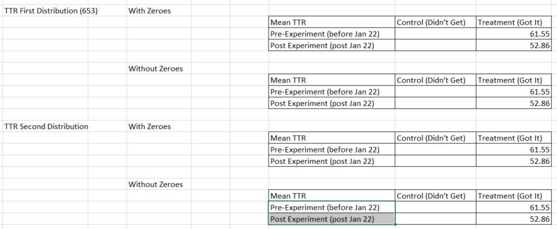

<style type="text/css">
p{ /* Normal  */
   font-size: 14px;
   line-height: 18px;
}
body{ /* Normal  */
   font-size: 14px;
}
td {  /* Table  */
   font-size: 12px;
}
h1 { /* Header 1 */
font-size: 26px;
color: #4294ce;
}
h2 { /* Header 2 */
font-size: 22px;
}
h3 { /* Header 3 */
font-size: 18px;
}
code.r{ /* Code block */
  font-size: 12px;
}
pre { /* Code block */
  font-size: 12px
}
#table-of-contents h2 {
background-color: #4294ce;
}
#table-of-contents{
background: #688FAD;
}
#nav-top span.glyphicon{
color: #4294ce;
}
#postamble{
background: #4294ce;
border-top: ;
}
</style>

```{r loadLibs1, warning=FALSE, message=FALSE, echo=FALSE}
#if(!require(bayesian_first_aid)){devtools::install_github("rasmusab/bayesian_first_aid")}
if(!require(kableExtra)){devtools::install_github("haozhu233/kableExtra")}
if(!require(easypackages)){install.packages("easypackages")}
library(easypackages)
packages("plyr", "dplyr", "ggplot2", "readr", "gridExtra", "readxl", "tidyr","stringr", "lubridate","knitr", "kableExtra",  prompt = FALSE)

setwd("~/Github/Valorem/ClientProjects/MS_O365")
```

# Abstract

# Introduction

On January 15, 2018, Microsoft introduced a new feature to enable Case Notes Search to help Agents find answers more quickly to reduce the time it takes to close a case.  This analysis evaluates A/B testing data to determine the impact the new feature has on selected metrics.  

> It may take time to truly understand the imapct the new feature may have.  Some variables in the calulations have few records.

When introducing a new feature in environments similar to O365 Support, it is possible a new feature may increase the time to resolve a ticket.  Agents may face a learning curve and/or   socialize the feature with peers.  Over time, these behavioral impacts should be minimized and the long-term impact of the new feature will be recognized.

# Get Data

Import the data provided by Microsoft originally 1/24/18.  The data consists of two files:

1. An Excel file named `AllAgentsDec1.xlsx` containing information of all agents with activity since Dec 1, 2017.  Updated 2/7/18 with `CompleteAgentList.xlsx`

2. An Excel file named `CaseNotesSearchABData.xlsx` with data starting January 15 - a week before the *Search Case Notes* feature was deployed to a subset of CIs (Concierge Insiders).  It contains data that will be used as the control group (the data prior to the test) and the test data (the records starting Jan 22).  The Excel file has 3 worksheets:

    1. Non-Concierge Insiders with no access to the new feature (NOT required with latest Agent file)
    2. Concierge Insiders with access to the new feature (NOT required with latest Agent file)
    3. Ticket Data - updated 1/29/2018, updated 2/2/2018, updated 2/8/2018 (CaseNotesSearchAB_Jan08_Feb08.xlsx)
    
Therefore, ~~4~~ 2 data sources will be imported.
 
```{r message=FALSE}
AllAgents_CI <- read_excel("C:/Users/cweaver/OneDrive - Valorem LLC/Projects/MS-O365/sharedData/CompleteAgentList.xlsx", sheet="ConciergeInsiders")#updated 2/8/18 - 459 records
AllAgents_NCI <- read_excel("C:/Users/cweaver/OneDrive - Valorem LLC/Projects/MS-O365/sharedData/CompleteAgentList.xlsx", sheet="NCI")#updated 2/8/18 - 9973 records

#used when MS provides data without header row
#colNames <- c("RequestId", "OrganizationId", "AgentID", "CreateDateTime", "AgentCaseAcceptTime",  "AgentPhoneContactTime", 
#              "ResolvedTime", "IsResolved", "CSATScore",  "ReScenario", "ModalityChannel",  "ConditionalTTR")

ABData_TicketData <- read_excel("C:/Users/cweaver/OneDrive - Valorem LLC/Projects/MS-O365/sharedData/CaseNotesSearch_AB_Jan08_Feb08_Correction2.xlsx")#2/9/18, adds AfterCallWorkCompleted

#colnames(ABData_TicketData) <- colNames
```

## Previous Data Files

- Agent Data
    - AllAgents <- read_excel("~/Github/Valorem/ClientProjects/MS_O365/data/AllAgentsDec1.xlsx")
    - ABData_NCI <- read_excel("~/Github/Valorem/ClientProjects/MS_O365/data/CaseNotesSearchABData.xlsx", sheet = "Non_Insiders")
    - ABData_CI <- read_excel("~/Github/Valorem/ClientProjects/MS_O365/data/CaseNotesSearchABData.xlsx", sheet = "Insiders")
- Ticket Data
    - ABData_TicketData <- read_excel("C:/Users/cweaver/OneDrive - Valorem LLC/Projects/MS-O365/sharedData/CaseNotesSearch_AB_Jan08_Feb09_Corrected.xlsx")
    - ABData_TicketData <- read_csv("C:/Users/cweaver/OneDrive - Valorem LLC/Projects/MS-O365/sharedData/CaseNotesSearch_AB_Jan08_Feb08.csv", col_names = FALSE)# 2/8/18 with 163918 records
    - ABData_TicketData <- read_excel("C:/Users/cweaver/OneDrive - Valorem LLC/Projects/MS-O365/sharedData/CaseNotesSearchAB_Jan08_Feb01.xlsx")#129,338 records
    - ABData_TicketData <- read_excel("~/Github/Valorem/ClientProjects/MS_O365/data/CaseNotesSearchAB_Jan29.xlsx")

## Prepare Data

### Agent Data

Combine `AllAgents_CI` and `AllAgents_NCI` into one source.  First add a column to each to noting the agents are `CIs` or `NCIs`.

```{r}
AllAgents_CI <- AllAgents_CI %>% mutate(InsiderRole = "CI")
AllAgents_NCI <- AllAgents_NCI %>% mutate(InsiderRole = "NCI")
AllAgents <- rbind(AllAgents_NCI, AllAgents_CI)
AllAgents <- plyr::rename(AllAgents, c("PartnerId" = "AgentID"))#Required only when data gets updated
rm(AllAgents_CI, AllAgents_NCI)
AllAgents$InsiderRole <-as.factor(AllAgents$InsiderRole)
glimpse(AllAgents)
```

### Ticket Data

- `IsResolved`, a variable of type `r class(ABData_TicketData$IsResolved)`, has three values:

```{r}
table(ABData_TicketData$IsResolved)
```
 
- 0:  Customer responded the issues was not resolved.
- 1:  Customer responded the issue was resolved.
- NULL:  No response from the customer.

Transform NULL to -1.
 
```{r message=FALSE, warning=FALSE}
ABData_TicketData$IsResolved <- as.integer(ABData_TicketData$IsResolved)
ABData_TicketData <- ABData_TicketData %>% mutate(IsResolved = ifelse(is.na(IsResolved), -1, IsResolved))
ABData_TicketData$IsResolved <- as.integer(ABData_TicketData$IsResolved)
table(ABData_TicketData$IsResolved)
```

- Cast variables from `character` to `integer` and `factor` as appropriate.

```{r message=FALSE}
ABData_TicketData$CSATScore <- as.integer(ABData_TicketData$CSATScore)
ABData_TicketData$TTR <- as.integer(ABData_TicketData$TTR)

ABData_TicketData$ReScenario <- as.factor(ABData_TicketData$ReScenario)
ABData_TicketData$ModalityChannel <- as.factor(ABData_TicketData$ModalityChannel)
```

- Cast date fields as `date` rather than `character`.

```{r message=FALSE}
ABData_TicketData$CreateDateTime <- ymd_hms(ABData_TicketData$CreateDateTime)
ABData_TicketData <- ABData_TicketData %>% mutate(createDoW = wday(CreateDateTime, label=TRUE))
ABData_TicketData <- ABData_TicketData %>% mutate(createHour = hour(CreateDateTime))

ABData_TicketData$AgentCaseAcceptTime <- ymd_hms(ABData_TicketData$AgentCaseAcceptTime)
ABData_TicketData <- ABData_TicketData %>% mutate(agentAcceptDoW = wday(AgentCaseAcceptTime, label=TRUE))
ABData_TicketData <- ABData_TicketData %>% mutate(agentAcceptHour = hour(AgentCaseAcceptTime))

ABData_TicketData$AgentPhoneContactTime <- ymd_hms(ABData_TicketData$AgentPhoneContactTime)
ABData_TicketData <- ABData_TicketData %>% mutate(agentPhoneDoW = wday(AgentPhoneContactTime, label=TRUE))
ABData_TicketData <- ABData_TicketData %>% mutate(agentPhoneHour = hour(AgentPhoneContactTime))


ABData_TicketData$ResolvedTime <- ymd_hms(ABData_TicketData$ResolvedTime)
ABData_TicketData <- ABData_TicketData %>% mutate(resolvedDoW = wday(ResolvedTime, label=TRUE))
ABData_TicketData <- ABData_TicketData %>% mutate(resolvedHour = hour(ResolvedTime))

ABData_TicketData$AfterCallWorkCompleted <- ymd_hms(ABData_TicketData$AfterCallWorkCompleted)
ABData_TicketData <- ABData_TicketData %>% mutate(completedDoW = wday(AfterCallWorkCompleted, label=TRUE))
ABData_TicketData <- ABData_TicketData %>% mutate(completedHour = hour(AfterCallWorkCompleted))

ABData_TicketData <- ABData_TicketData %>% select(RequestId, OrganizationId, AgentID, 
                                              CreateDateTime, createDoW, createHour, 
                                              AgentCaseAcceptTime, agentAcceptDoW, agentAcceptHour, 
                                              AgentPhoneContactTime, agentPhoneDoW, agentPhoneHour,
                                              ResolvedTime, resolvedDoW, resolvedHour, 
                                              AfterCallWorkCompleted, completedDoW, completedHour, 
                                              everything())
```

> Not adjusting for `NA` values.

## Join Data Files

Join `AllAgents` with `ABData_TicketData`.

```{r}
ABData_complete <-left_join(ABData_TicketData, AllAgents, by = "AgentID")
#Using left join rather than inner join to identify any tickets where we are missing an Agent
rm(AllAgents)
# sum(is.na(ABData_complete$InsiderRole))
# myMissAgents <- ABData_complete %>% filter(is.na(InsiderRole))
# write.csv(myMissAgents, "MissingAgentRecords.csv")
```

Remove redundant variable `OrganizationId.y`.

```{r}
ABData_complete <- ABData_complete %>% select(-OrganizationId.y)
ABData_complete <- plyr::rename(ABData_complete, c("OrganizationId.x" = "OrganizationId"))
```

`r sum(is.na(ABData_complete$InsiderRole))` records are not associated with a CI or NCI agent.  Remove them.

```{r}
ABData_complete <- filter(ABData_complete, !is.na(InsiderRole))
glimpse(ABData_complete)
```

BiModal TTR Distribution Returns

Recall from other analyses, the log(TTR) histogram produces a bi-modal distribution. 

```{r message=FALSE, warning=FALSE}
p1 <- ggplot(aes(x = TTR), data = ABData_complete) + geom_histogram() + scale_x_log10() + ggtitle("log(TTR)")
p1

p1Data <- ggplot_build(p1)
#Gets values actually plotted you can use function ggplot_build() where argument is your plot.
```

Because the bi-modal distribution is evident, the analysis will focus on the first peak.  (Statistical test typically require relatively large numbers of records.  Focusing on data that is normal permits us to proceed with the data available.)

> A revision to this document will repeat the analysis using the 2nd peak data

Identify where the cutoff is for the first peak by finding the value on the x axis in the valley between the two peaks.

```{r message=FALSE, warning=FALSE}
# This sublist contains dataframe with values used in plot, for example, for histogram it contains y values (the same as count). If there are more than one geom_ in your plot then data will contains dataframes for each
#If you need just data it seems layer_data is designed precisely for this: layer_data(p2,1)
layer_data(p1,1)
```

Evaluating data, the max and min values of the peaks are found.

-  The first peak occurs y = 11046, x = 1.447 (anti-log = `r round(10^1.447, 3)`).  The second peak is where y = 11490, x = 3.215 (anti-log = `r round(10^3.215,3)`).
-  The lowest y value after the first peak is y = 512, x = 2.894 (anti-log of 2.894 = `r round(10^2.894, 3)`.)

Filter the data by x < 783.

Beginning with `r nrow(ABData_complete)` records before filtering.

```{r}
TTR_2ndPeak <- ABData_complete %>% filter(TTR >= 773)
ABData_complete <- ABData_complete %>% filter(TTR < 773)
```

After filtering the number of TTR records is `r nrow(ABData_complete)`.

Add a column, `dateLive`, to facilitate the statistical analysis by introducing a column describing each record as `Control` or `Treatment` indicating if the record opened before the new feature introduction or after the new new feature was available.

```{r}
ABData_complete <- ABData_complete %>% mutate(dateLive = if_else(CreateDateTime < '2018-01-22', "Control", "Treatment"))
TTR_2ndPeak <- TTR_2ndPeak %>% mutate(dateLive = if_else(CreateDateTime < '2018-01-22', "Control", "Treatment"))
```

```{r saveDataObjects, echo=FALSE, eval=FALSE}
setwd("~/Github/Valorem/ClientProjects/MS_O365")
save.image("CaseNotesData.RData")
```

#TTR Analysis - First Peak

Originally, the data was filtered further by removing $TTR < 1$ (`r sum(ABData_TicketData$TTR<1)` records.)

> In meeting 2/2/18, it was decided to run tests with and without TTR = 0.

During the same meeting, a reporting format was developed.  The format below is recreated in code after the TTR analysis and a similarly formatted reporting table summarizes the proportion tests, *infra*.

```{r, out.width = "400px", echo=FALSE}

```

```{r}
TTR_No_0 <- ABData_complete %>% filter(TTR > 0)
TTR_with_0 <- ABData_complete %>% filter(TTR > -1)
save.image("CaseNotesTTR.RData")#Image for TTR New Method
```

## Methodology

During a Team Meeting Friday, January 19, 2018, the Team identified the methodology to be used in in this analysis.  

- Data will be collected before the Case Notes feature was implemented and after implementation.
- When the Case Notes feature is implemented, all CIs will get the new feature.
- The difference between the mean TTR for CIs before and after the Case Notes feature is implemented will be used to calculate the impact of the new feature.

> This methodology is not ideal but adapted to the limitations the data store.  There is no way to randomly selected CI and NCI agents.  This prevents running the test with two populations simultaneously.  This forces the analysis to use before/after data.  This introduces risk - other factors could influence the results since the data is collected at different times.

## TTR Mean Analysis

```{r}
TTR_No_0_CI <- TTR_No_0 %>% filter(InsiderRole == 'CI')
TTR_with_0_CI <- TTR_with_0 %>% filter(InsiderRole == 'CI')

TTR_No_0_NCI <- TTR_No_0 %>% filter(InsiderRole == 'NCI')
TTR_with_0_NCI <- TTR_with_0 %>% filter(InsiderRole == 'NCI')
```

Evaluate CI records: (`r nrow(TTR_No_0_CI)` No 0's; `r nrow(TTR_with_0_CI)`) records including TTR = 0.

```{r}
t_CI_No_0 <- t.test(TTR ~ dateLive, TTR_No_0_CI)

t_CI_with_0 <- t.test(TTR ~ dateLive, TTR_with_0_CI)
```

Evaluate NCI records: (`r nrow(TTR_No_0_NCI)` No 0's; `r nrow(TTR_with_0_NCI)`) records including TTR = 0.

```{r}
t_NCI_No_0 <- t.test(TTR ~ dateLive, TTR_No_0_NCI)

t_NCI_with_0 <- t.test(TTR ~ dateLive, TTR_with_0_NCI)
```

## TTR Summary

```{r kableExtraTable, echo=FALSE}
#Build df for kable - https://cran.r-project.org/web/packages/kableExtra/vignettes/awesome_table_in_html.html
myTableDF <- setNames(data.frame(matrix(ncol = 6, nrow = 4)), c("Mean TTR", "pvalueC",  "CountC",
                                                                  "Mean TTR ", "pvalueT", "CountT"))
rownames(myTableDF) <- c("Pre-Experiment (before Jan 22)", "Post Experiment (post Jan 22)", 
                         "Pre-Experiment (before Jan 22) ", "Post Experiment (post Jan 22) ")
#t-test mean values
myTableDF[1,1] <- round(t_NCI_with_0$estimate[1], 2)
myTableDF[2,1] <- round(t_NCI_with_0$estimate[2], 2)

myTableDF[1,4] <- round(t_CI_with_0$estimate[1], 2)
myTableDF[2,4] <- round(t_CI_with_0$estimate[2], 2)

myTableDF[3,1] <- round(t_NCI_No_0$estimate[1], 2)
myTableDF[4,1] <- round(t_NCI_No_0$estimate[2], 2)

myTableDF[3,4] <- round(t_CI_No_0$estimate[1], 2)
myTableDF[4,4] <- round(t_CI_No_0$estimate[2], 2)

#t-test p-values
myTableDF[1,2] <- round(t_NCI_with_0$p.value, 5)
myTableDF[2,2] <- ""

myTableDF[1,5] <- round(t_CI_with_0$p.value, 5)
myTableDF[2,5] <- ""

myTableDF[3,2] <- round(t_NCI_No_0$p.value, 5)
myTableDF[4,2] <- ""

myTableDF[3,5] <- round(t_CI_No_0$p.value, 5)
myTableDF[4,5] <- ""

#Record counts

myTableDF[1,3] <- nrow(TTR_with_0_NCI)
myTableDF[2,3] <- ""

myTableDF[3,3] <- nrow(TTR_No_0_NCI)
myTableDF[4,3] <- ""

myTableDF[1,6] <- nrow(TTR_with_0_CI)
myTableDF[2,6] <- ""

myTableDF[3,6] <- nrow(TTR_No_0_CI)
myTableDF[4,6] <- ""

#color code p-values

myTableDF <- myTableDF %>% mutate(Experiment = row.names(.), pvalueC = cell_spec(pvalueC, 'html', color = ifelse(pvalueC < 0.05, "green", "red")), pvalueT = cell_spec(pvalueT, 'html', color = ifelse(pvalueT < 0.05, "green", "red")))
myTableDF <- myTableDF %>% select(Experiment, everything())

kable(myTableDF, "html", escape = F) %>%  kable_styling(bootstrap_options = c("striped", "hover", "condensed", full_width = F)) %>% 
  group_rows("With TTR > -1", 1, 2) %>% group_rows("TTR > 0", 3, 4) %>%  add_header_above(c("TTR - First Peak"=1, "Control - Did Not Get" = 3,
                                                                                           "Treatment - Got It" = 3)) %>% 
  footnote(general = "p-values in green are statistically significant (feature impacted metric values)",
           number = c("p-value = 0 is simply rounded to 5 digits"))

```

The interpretation of the results depends heavily on the determination of what TTR = 0 represents.  Dean and Team are evaluating.  

#TTR Analysis - Second Peak

Below are the results using the data from the second peak in the log(TTR) histogram.  The code is the same and therefore not displayed; only the results are provided below.

Recall from above, the second peak in the distribution starts with $TTR > 782$.

> There is no second test because the 2nd peak cannot have any TTR values that include 0.

```{r TTR2ndPeak, message=FALSE, echo=FALSE}
#TTR_2ndPeak is the DF available for analysis

TTR_2ndPeak_CI <- TTR_2ndPeak %>% filter(InsiderRole == 'CI')
TTR_2ndPeak_NCI <- TTR_2ndPeak %>% filter(InsiderRole == 'NCI')

t_CI_2nd <- t.test(TTR ~ dateLive, TTR_2ndPeak_CI)
t_NCI_2nd <- t.test(TTR ~ dateLive, TTR_2ndPeak_NCI)

#Build df for kable - https://cran.r-project.org/web/packages/kableExtra/vignettes/awesome_table_in_html.html
myTableDF <- setNames(data.frame(matrix(ncol = 6, nrow = 2)), c("Mean TTR", "pvalueC",  "CountC",
                                                                  "Mean TTR ", "pvalueT", "CountT"))
rownames(myTableDF) <- c("Pre-Experiment (before Jan 22)", "Post Experiment (post Jan 22)")
#t-test mean values
myTableDF[1,1] <- round(t_NCI_2nd$estimate[1], 2)
myTableDF[2,1] <- round(t_NCI_2nd$estimate[2], 2)

myTableDF[1,4] <- round(t_CI_2nd$estimate[1], 2)
myTableDF[2,4] <- round(t_CI_2nd$estimate[2], 2)

#t-test p-values
myTableDF[1,2] <- round(t_NCI_2nd$p.value, 5)
myTableDF[2,2] <- ""

myTableDF[1,5] <- round(t_CI_2nd$p.value, 5)
myTableDF[2,5] <- ""

#Record counts

myTableDF[1,3] <- nrow(TTR_2ndPeak_NCI)
myTableDF[2,3] <- ""

myTableDF[1,6] <- nrow(TTR_2ndPeak_CI)
myTableDF[2,6] <- ""

#color code p-values

myTableDF <- myTableDF %>% mutate(Experiment = row.names(.), pvalueC = cell_spec(pvalueC, 'html', color = ifelse(pvalueC < 0.05, "green", "red")), pvalueT = cell_spec(pvalueT, 'html', color = ifelse(pvalueT < 0.05, "green", "red")))
myTableDF <- myTableDF %>% select(Experiment, everything())

kable(myTableDF, "html", escape = F) %>% kable_styling(bootstrap_options = c("striped", "hover", "condensed", 
    full_width = F)) %>% add_header_above(c("TTR - 2nd Peak"=1, "Control - Did Not Get" = 3,"Treatment - Got It" = 3)) %>% 
  footnote(general = "p-values in green are statistically significant (feature impacted metric values)",
           number = c("p-value = 0 is simply rounded to 5 digits"))

```


# Proportion Tests


```{r propSummaryTable1, echo=FALSE, eval=FALSE}
#Build DF as the prop test are run so DF is available for summary kable table
#Build df for kable - https://cran.r-project.org/web/packages/kableExtra/vignettes/awesome_table_in_html.html

rm(list= ls()[!(ls() %in% c('ABData_complete','AllAgents', 'TTR_2ndPeak'))])

myTableDFp <- setNames(data.frame(matrix(ncol = 5, nrow = 8)), c("pvalue",  "pControl", "pTreatment ", "cControl", "cTreatment"))
rownames(myTableDFp) <- c("Agent Reopen (CI)","Agent Reopen (NCI)", "Customer Reopen (CI)", "Customer Reopen (NCI)",
                          "Repeat Caller (CI)", "Repeat Caller (NCI)", "IsResolved (CI)", "IsResolved (NCI)")
```

```{r propSummaryTable1, echo=FALSE}
rm(list= ls()[!(ls() %in% c('ABData_complete','AllAgents', 'TTR_2ndPeak'))])

myTableDFp <- setNames(data.frame(matrix(ncol = 3, nrow = 4)), c("pvalue",  "cControl", "cTreatment"))
rownames(myTableDFp) <- c("Agent Reopen", "Customer Reopen", "Repeat Caller", "IsResolved")
```

The results and interpretation of the results are presented in the Proportion Results Summary Table presented after the tests are completed below.

## Agent Reopen
### Agent Reopen - CI

To perform a proportion test (compared to the mean calculation above), a bit of data manipulation is needed. The following logic is used for the proportion tests that follow.

- Calculate the number tickets reopened by CI agents *before* the new feature was implemented (**Control**).  **Var1_CI**
- Calculate the number of tickets reopened by CI agents *after* the new feature was implemented (**Treatment**).  **Var2_CI**
- Calculate the number of tickets CI tickets *before* the new feature was implemented (**Control**). **Var3_CI**
- Calculate the number of tickets CI tickets *after* the new feature was implemented (**Treatment**).  **Var4_CI**

Using the data collected above, simple proportions are compared using generally accepted statistical methods.

`prop.test(c(count of Reopen CI in Control, count of Reopen CI in Treatment), 
          c(count of ReScenario != No ReScenario CI in Control, count of ReScenario != No ReScenario CI in Treatment))`

```{r echo=FALSE}
Var1_CI <- nrow(filter(ABData_complete, ReScenario == 'Agent Reopen', dateLive == "Control", InsiderRole == 'CI'))
Var2_CI <- nrow(filter(ABData_complete, ReScenario == 'Agent Reopen', dateLive == "Treatment", InsiderRole == 'CI'))

Var3_CI <- nrow(filter(ABData_complete, ReScenario != 'No ReScenario', dateLive == "Control", InsiderRole == 'CI'))
Var4_CI <- nrow(filter(ABData_complete, ReScenario != 'No ReScenario', dateLive == "Treatment", InsiderRole == 'CI'))

#agentReopen_CI <- prop.test(c(Var1_CI, Var2_CI), c(Var3_CI, Var4_CI), correct =  F)
```

### Agent Reopen - NCI

```{r echo=FALSE}
Var1_NCI <- nrow(filter(ABData_complete, ReScenario == 'Agent Reopen', dateLive == "Control", InsiderRole == 'NCI'))
Var2_NCI <- nrow(filter(ABData_complete, ReScenario == 'Agent Reopen', dateLive == "Treatment", InsiderRole == 'NCI'))

Var3_NCI <- nrow(filter(ABData_complete, ReScenario != 'No ReScenario', dateLive == "Control", InsiderRole == 'NCI'))
Var4_NCI <- nrow(filter(ABData_complete, ReScenario != 'No ReScenario', dateLive == "Treatment", InsiderRole == 'NCI'))

agentReopen_NCI <- prop.test(c(Var1_NCI, Var2_NCI), c(Var3_NCI, Var4_NCI), correct =  F)
```

```{r FisherAgentReopen}
myMatrix <- matrix(c(Var1_CI, Var2_CI, Var1_NCI, Var2_NCI), nrow=2, byrow = T)
fisherAgentReopen <- fisher.test(myMatrix)
```


```{r buildTableAgentReopen}
myTableDFp[1,1] <- round(fisherAgentReopen$p.value,5)
myTableDFp[1,2] <- round((agentReopen_CI$estimate[1])*100,2)
myTableDFp[1,3] <- round((agentReopen_CI$estimate[2])*100,2)
myTableDFp[1,4] <- Var1_CI
myTableDFp[1,5] <- Var2_CI

myTableDFp[2,1] <- round(agentReopen_NCI$p.value,5)
myTableDFp[2,2] <- round((agentReopen_NCI$estimate[1])*100,2)
myTableDFp[2,3] <- round((agentReopen_NCI$estimate[2])*100,2)
myTableDFp[2,4] <- Var1_NCI
myTableDFp[2,5] <- Var2_NCI
```

## Proportion Testing Interpretation

To ensure the results are understood:

- The p-value tells you how likely it is that both the proportions are equal.  If the p-value > 0.05, the populations are statistically the same.
- Note the value of 0 lies between the confidence interval provided in the results.  This means the two proportions are the same, or put in a different way, not statistically significant.  This is reflected in the p-value > 0.05.
- `prop 1` is simply the proportion of `Var1` (`r Var1_CI`) divided by `Var3` (`r Var3_CI`).  This is simply the proportion of CI Agent Reopened tickets prior to the release of the new feature.
- Similarly, `prop2` is the proportion of tickets Agent Reopens after the new feature was released to the CI agents.

##Customer Reopen
###Customer Reopen - CI

Note `Var3_CI`, `Var4-CI`, `Var3_NCI` and `Var4_NCI` are unchanged and are reused.

```{r}
Var1_CI <- nrow(filter(ABData_complete, ReScenario == 'Customer Reopen' & dateLive == "Control",  InsiderRole == 'CI'))
Var2_CI <- nrow(filter(ABData_complete, ReScenario == 'Customer Reopen' & dateLive == "Treatment",  InsiderRole == 'CI'))

custReopen_CI <- prop.test(c(Var1_CI, Var2_CI), c(Var3_CI, Var4_CI), correct =  F)
custReopen_CI
```

### Customer Reopen - NCI

```{r}
Var1_NCI <- nrow(filter(ABData_complete, ReScenario == 'Customer Reopen' & dateLive == "Control",  InsiderRole == 'NCI'))
Var2_NCI <- nrow(filter(ABData_complete, ReScenario == 'Customer Reopen' & dateLive == "Treatment",  InsiderRole == 'NCI'))

custReopen_NCI <-  prop.test(c(Var1_NCI, Var2_NCI), c(Var3_NCI, Var4_NCI), correct =  F)
custReopen_NCI
```

```{r buildTableCusttReopen}
myTableDFp[3,1] <- round(custReopen_CI$p.value,5)
myTableDFp[3,2] <- round((custReopen_CI$estimate[1])*100,2)
myTableDFp[3,3] <- round((custReopen_CI$estimate[2])*100,2)
myTableDFp[3,4] <- Var1_CI
myTableDFp[3,5] <- Var2_CI

myTableDFp[4,1] <- round(custReopen_NCI$p.value,5)
myTableDFp[4,2] <- round((custReopen_NCI$estimate[1])*100,2)
myTableDFp[4,3] <- round((custReopen_NCI$estimate[2])*100,2)
myTableDFp[4,4] <- Var1_NCI
myTableDFp[4,5] <- Var2_NCI
```

## Repeat Caller
### Repeat Caller - CI

```{r}
Var1_CI <- nrow(filter(ABData_complete, ReScenario == 'Repeat Caller' & dateLive == "Control",  InsiderRole == 'CI'))
Var2_CI <- nrow(filter(ABData_complete, ReScenario == 'Repeat Caller' & dateLive == "Treatment",  InsiderRole == 'CI'))

repeatCaller_CI <- prop.test(c(Var1_CI, Var2_CI), c(Var3_CI, Var4_CI), correct = F)
repeatCaller_CI
```

### Repeat Caller - NCI

```{r}
Var1_NCI <- nrow(filter(ABData_complete, ReScenario == 'Repeat Caller' & dateLive == "Control",  InsiderRole == 'NCI'))
Var2_NCI <- nrow(filter(ABData_complete, ReScenario == 'Repeat Caller' & dateLive == "Treatment",  InsiderRole == 'NCI'))

repeatCaller_NCI <- prop.test(c(Var1_NCI, Var2_NCI), c(Var3_NCI, Var4_NCI), correct = F)
repeatCaller_NCI
```

```{r buildTableRepeatCaller}
myTableDFp[5,1] <- round(repeatCaller_CI$p.value,5)
myTableDFp[5,2] <- round((repeatCaller_CI$estimate[1])*100,2)
myTableDFp[5,3] <- round((repeatCaller_CI$estimate[2])*100,2)
myTableDFp[5,4] <- Var1_CI
myTableDFp[5,5] <- Var2_CI

myTableDFp[6,1] <- round(repeatCaller_NCI$p.value,5)
myTableDFp[6,2] <- round((repeatCaller_NCI$estimate[1])*100,2)
myTableDFp[6,3] <- round((repeatCaller_NCI$estimate[2])*100,2)
myTableDFp[6,4] <- Var1_NCI
myTableDFp[6,5] <- Var2_NCI
```

## IsResolved
### IsResolved - CI (Treatment)

```{r}
Var1_CI <- nrow(filter(ABData_complete, IsResolved == 1 & dateLive == "Control",  InsiderRole == 'CI'))
Var2_CI <- nrow(filter(ABData_complete, IsResolved == 1 & dateLive == "Treatment",  InsiderRole == 'CI'))

Var3_CI <- nrow(filter(ABData_complete, IsResolved > -1,  dateLive == "Control", InsiderRole == 'CI'))
Var4_CI <- nrow(filter(ABData_complete, IsResolved > -1, dateLive == "Treatment", InsiderRole == 'CI'))

IsResolved_CI <- prop.test(c(Var1_CI, Var2_CI), c(Var3_CI, Var4_CI), correct =  F)
IsResolved_CI
```

### IsResolved - NCI (Control)

```{r}
Var1_NCI <- nrow(filter(ABData_complete, IsResolved == 1 & dateLive == "Control",  InsiderRole == 'NCI'))
Var2_NCI <- nrow(filter(ABData_complete, IsResolved == 1 & dateLive == "Treatment",  InsiderRole == 'NCI'))

Var3_NCI <- nrow(filter(ABData_complete, IsResolved > -1,  dateLive == "Control", InsiderRole == 'NCI'))
Var4_NCI <- nrow(filter(ABData_complete, IsResolved > -1, dateLive == "Treatment", InsiderRole == 'NCI'))

IsResolved_NCI <- prop.test(c(Var1_NCI, Var2_NCI), c(Var3_NCI, Var4_NCI), correct =  F)
IsResolved_NCI
```

```{r buildTableIsResolved}
myTableDFp[7,1] <- round(IsResolved_CI$p.value,5)
myTableDFp[7,2] <- round((IsResolved_CI$estimate[1])*100,2)
myTableDFp[7,3] <- round((IsResolved_CI$estimate[2])*100,2)
myTableDFp[7,4] <- Var1_CI
myTableDFp[7,5] <- Var2_CI

myTableDFp[8,1] <- round(IsResolved_NCI$p.value,5)
myTableDFp[8,2] <- round((IsResolved_NCI$estimate[1])*100,2)
myTableDFp[8,3] <- round((IsResolved_NCI$estimate[2])*100,2)
myTableDFp[8,4] <- Var1_NCI
myTableDFp[8,5] <- Var2_NCI
```

## Proportion Testing Results Summary

```{r echo=FALSE}
#color code p-values
myTableDFp <- myTableDFp %>% mutate(Experiment = row.names(.), pvalue = cell_spec(pvalue, 'html', color = ifelse(pvalue < 0.05, "green", "red")))

myTableDFp <- myTableDFp %>% select(Experiment, everything())

kable(myTableDFp, "html", escape = F) %>%  kable_styling(bootstrap_options = c("condensed", full_width = F)) %>% 
  add_header_above(c("Case Search Feature"=1, " " = 1, "Proportions (p)" = 2, "Record Count (c)" = 2)) %>% 
  footnote(general = "p-values in green are statistically significant (feature impacted metric values)",
           number = c("p-value = 0 is simply rounded to 5 digits", "Low record counts should minimize reliance of significant p-values")) %>% 
  row_spec(3:4, background = "#e8e5da") %>% row_spec(7:8, background = "#e8e5da")
```

### Observations from the Proportion Test Results

- Several tests appear to support the conclusion the Case Search Feature improved the metrics
    - `IsResolved` improved for both the CI population and the NCI population.  
       - Because the NCI metric improved, does this suggest there are confounding factor that affected both the CI and NCI population?  
       - What other changes happened during the weeks before and after Jan 22, 2018 that may have influenced these results?
       - Data cannot answer these questions.  Perhaps a program or product resource can help.
    - `Repeat Caller` metrics improved across CI and NCI populations.
        - The same questions apply as those from `IsResolved`.
        - Note the count of `Repeat Callers` in the NCI population - only 5 records.  Statistical analysis always provides a result.  However, rational thinking must override math results when so few records are available.  Suggest more data be collected before drawing any conclusions for `Repeat Caller`.
    - `Customer Reopen` is interesting.  CI population test inconclusive (only 68 records) while the NCI population shows an increase in `Customer Reopen`.

---------------------

# Appendix

## t-Test Bayesian Approach (WIP)

To be evaluated:

See http://www.sumsar.net/blog/2014/02/bayesian-first-aid-one-sample-t-test/

Installing JAGS is troublesome.  Need to investigate.

```{r}
#library(BayesianFirstAid)

```

## Historical TTR Means

In previous efforts, a larger data set was used to calculate TTR means (among other statistical analyses).

```{r message=FALSE, warning=FALSE}
myData <- read_excel("~/Github/Valorem/ClientProjects/MS_O365/data/CaseNotesSearchABHistorical_Dec13.xlsx")

myData2 <- myData %>% mutate(Date = as.Date(CreateDateTime), Hour = hour(CreateDateTime), ReScenario = factor(ReScenario)) %>%
  filter(TTR > 0) %>% drop_na(IsResolved, Roles) %>% mutate(Concierge = str_detect(Roles, "FirstRelease")) %>% 
  mutate(Agent = str_detect(Roles, "Agent")) %>%    
  select(-RequestID, -PartnerId,-CreateDateTime,  -Date, -Hour)
# remove 3 records where Agent = FALSE and Rave2 = FALSE:  table(myData2$Agent)
myData2 <- filter(myData2, Agent == TRUE)
myData2 <- myData2 %>% mutate(NewRole = ifelse(Concierge == TRUE, "Concierge", "Agent"))

p1 <- ggplot(aes(x = TTR), data = myData2) + geom_histogram() + scale_x_log10() + ggtitle("log(TTR)")

p1Data <- ggplot_build(p1)
#Get values actually plotted you can use function ggplot_build() where argument is your plot.

# This will make list and one of sublists is named data. This sublist contains dataframe with values used in plot, for example, for histrogramm it contains y values (the same as count). If you use facets then column PANEL shows in which facet values are used. If there are more than one geom_ in your plot then data will contains dataframes for each
#If you need just data it seems layer_data is designed precisely for this: layer_data(p2,1)
layer_data(p1,1)
```

The minimum value after the first peak is y = 246, x = 2.813.  The antilogarithm of 2.813 = 650.

```{r}
myDataCI <- myData2 %>% filter(TTR < 650,TTR > 0,  NewRole == "Concierge")
myDataNCI <- myData2 %>% filter(TTR < 650,TTR > 0,  NewRole == "Agent")
mean(myDataCI$TTR); mean(myDataNCI$TTR)
```

