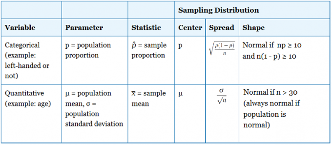
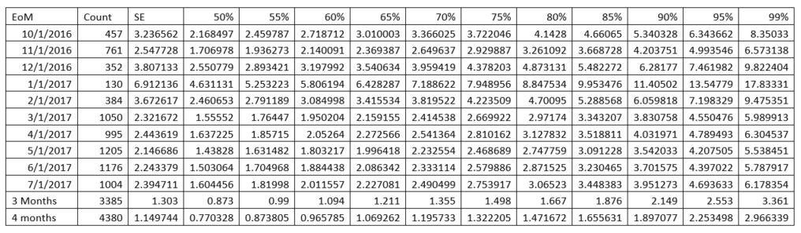

```{r}
setwd("~/Github/Valorem/ClientProjects/MS_O365")
```


You want to know what sample size you need for an experiment in which you are seeking to determine whether or not the difference in two proportions of success is statistically significant. Here is the traditional process:

Look at historical data to establish baseline predictions. Say that in the past, taking an action results in a 10% success rate whereas not taking an action results in a 9% success rate. Assume that these conclusions have not been statistically validated but that they are based on relatively large amounts of data (10,000+ observations).

Plug these assumptions into power.prop.test to get the following:

```{r}
 power.prop.test(p1=.1,p2=.11,power=.9)
```

This suggests you need a sample size of ~20000 in each group of an A/B test in order to detect a significant difference between proportions.

The next step is to perform the experiment with 20,000 observations in each group. Group B (no action taken) has 2300 successes out of 20,000 observations, whereas Group A (action taken) has 2200 successes out of 20,000 observations.

Do a prop.test

```{r}
prop.test(c(2300,2100),c(20000,20000))
```

You can reject the null hypothesis that the proportions are equal.

-----------------

An important question when designing an experiment is “How big a sample do I need?” A larger sample will give more accurate results, but at a cost. Use too small a sample, and you may get inconclusive results; too large a sample, and you’re wasting resources.

To calculate the required sample size, you’ll need to know four things:

- The size of the response you want to detect
- The variance of the response
- The desired significance level
- The desired power

**Delta**

Suppose you are comparing a treatment group to a placebo group, and you will be measuring some continuous response variable which, you hope, will be affected by the treatment. We can consider the mean response in the treatment group, μ1, and the mean response in the placebo group, μ2. We can then define Δ = μ1 – μ2. The smaller the difference you want to detect, the larger the required sample size.

**Variance**

Of the four variables that go into the sample size calculation, the variance of the responses can be the most difficult to determine. Usually, before you do your experiment, you don’t know what variance to expect. Investigators often conduct a pilot study to determine the expected variance, or information from a previous published study can be used.

> The effect size combines the minimal relevant difference and the variability into one measurement, Δ/σ

**Significance**

Significance is equal to 1 – α, where α is the probability of making a Type 1 Error. That is, alpha represents the chance of a falsely rejecting H0 and picking up a false-positive effect. Alpha is usually set at 0.05, for a 95% significance.

**Power** 

The power of a test is 1-β, where beta is the probability of a Type 2 error (failing to reject the null hypothesis when the alternative hypothesis is true). In other words, if you have a 20% chance of failing to detect a real difference, then the power of your test is .8.

**Sample Size Calculation**

The calculation for the total sample size is:

$$n=\frac{4(Z_{\alpha}+Z_{\beta})^2\sigma^2}{\Delta^2}$$

For a two-sided test, we use Zα/2 instead of Zα.

For example, suppose we want to be able to detect a difference of 20 units, with 90% power using a two-sided t-test, and a .05 significance level. We are expecting, based on previous research, that the standard deviation of the responses will be about 60 units.

In this example, α=.05, β=.10, Δ=20, and σ=60. Zα/2=1.96, and Zβ=1.28. So we have:

$$n=\frac{4(1.96+1.28)^2\sigma^2}{20^2}\approx 378$$
or, about 189 for each treatment group.

**Sample Size in R**
You could write a function in R to do the above calculation, but fortunately, you don’t need to. The `pwr` library has done it for you. In this case, we will use the `pwr.t.test()` function.

pwr.t.test(n = , d = , sig.level = , power = , type = c(“two.sample”, “one.sample”, “paired”))

In this case, we will leave out the “n=” parameter, and it will be calculated by R. If we fill in a sample size, and use “power = NULL”, then it will calculate the power of our test.

In this equation, d is the effect size, so we will calculate that from our delta and sigma values. In R, it looks like this:

```{r message=FALSE}
library(pwr)
delta <- 20
sigma <- 60
d <- delta/sigma
pwr.t.test(d=d, sig.level=.05, power = .90, type = 'two.sample')
```

See https://www.statmethods.net/stats/power.html

-----------------

The general [formula](http://csrgxtu.github.io/2015/03/20/Writing-Mathematic-Fomulars-in-Markdown/) for the margin of error for the sample mean (assuming a certain condition is met — see below) is

$$MOE = z*\frac{\sigma}{\sqrt{n}}$$
where $\sigma$ is the population standard deviation, n is the sample size, and z is the appropriate z - value for your desired level of confidence (which you can find in the following table).

To calculate n:  $$n=(\frac{z*\sigma}{MOE})^2$$

z-Values for Selected (Percentage) Confidence Levels

| Percentage Confidence |	z-Value |
| --- | ----- |
| 80 |	1.28 |
| 90 | 1.645 |
|95	| 1.96 |
|98	| 2.33 |
|99	| 2.58 |

```{r}
###############################################################################
#                           Sample Size  and Confidence Interval Calculation  #
#                           v 1.3 by "Ananda Mahto"/mrdwab/ananda@mahto.info  #
#  2011 May 17                                                                #
# --------------------------------------------------------------------------- #
#                                                                             #
#  Example usage:                                                             #
#    * sample.size.table(c.lev = c(90, 95, 98, 99), population = 378)         #
#    * sample.size(c.lev = 98, population = 200)                              #
#    * confidence.interval(c.lev = 95, p.ss = 80, population = 100)           #
#                                                                             #
#  Advanced usage:                                                            #
#    * sample.size.table (c.lev = rep(c(95:99), each = 5),                    #
#                         c.int = c(1:5), pop = 100)                          #
#    * sample.size.table (c.lev = rep(c(95:99)), c.int = 5,                   #
#                         pop = rep(c(101:105), each=5))                      #
# --------------------------------------------------------------------------- #
#  Notes:                                                                     #
#         c.lev = confidence level, usually 90 or 95                          #
#        margin = usually set at 50%, which gives the largest sample size     #
#    c.interval = confidence interval, usually +/- 5%                         #
#    population = the entire population you want to draw a sample from        #
#          p.ss = your population sample size                                 #
###############################################################################

sample.size.table = function(c.lev, margin=50, c.interval=5, population) {
  z      = qnorm(.5+c.lev/200)
  m      = margin/100
  int    = c.interval/100
  ss     = (z^2 * m * (1-m))/(int^2)
  p.ss   = ss/(1 + ((ss-1)/population))
  CL     = c(paste(c.lev, "%", sep = ""))
  CI     = c(paste(c.interval, "%", sep = ""))
  M      = c(paste(margin, "%", sep = ""))
  METHOD = c("Sample size calculations")
  RES    = data.frame(population, CL, CI, M, round(p.ss, digits = 0))
  pre    = structure(list(POP = "Population", CL = "Confidence level",
           CI = "Confidence interval (+/-)", MOE = "Margin of error",
		   SS = "Sample size", method = METHOD), class = "power.htest")
  names(RES) = c("POP","CL", "CI", "MOE", "SS")
  print(pre)
  print(RES)
}

sample.size = function(c.lev, margin=.5, c.interval=.05, population) {
  z.val  = qnorm(.5+c.lev/200)
  ss     = (z.val^2 * margin * (1-margin))/c.interval^2
  p.ss   = round((ss/(1 + ((ss-1)/population))), digits=0)
  METHOD = paste("Recommended sample size for a population of ",  population,
           " at a ", c.lev, "% confidence level", sep = "")
  moe    = paste((c.interval*100), "%", sep="")
  resp.dist = paste((margin*100),"%", sep="")
  structure(list(Population = population, "Confidence level" = c.lev, 
  "Margin of error" = moe, "Response distribution" = resp.dist,
  "Recommended sample size" = p.ss, method = METHOD), class = "power.htest")
}

confidence.interval = function(c.lev, margin=.5, p.ss, population) {
  z.val      = qnorm(.5+c.lev/200)
  ss         = ((population*p.ss-p.ss)/(population-p.ss))
  c.interval = sqrt((z.val^2 * margin * (1-margin))/ss)
  r.cint     = round(c.interval*100, digits = 2)
  METHOD     = paste("The confidence interval is ", r.cint, 
               "% with the following assumptions:", sep = "")
  resp.dist  = paste((margin*100),"%", sep="")
  structure(list(Population = population, "Sample size" = p.ss,
  "Confidence level" = c.lev, "Response distribution" = resp.dist, 
  method = METHOD), class = "power.htest")
}

```

---------------
```{r warning=FALSE}
library(scales)
library(ggplot2)
p1 <- 0.1 # baseline rate
b <- 0.8 # power
a <- 0.05 # significance level
dd <- seq(from = 0.01, to = 0.04, by = 0.0001) # detectable differences
result <- data.frame(matrix(nrow = length(dd), ncol = 2))
names(result) <- c("DD", "ni")
for (i in 1:length(dd)) {
  result[i, "DD"] <- dd[i]
  result[i, "ni"] <- power.prop.test(sig.level = a, p1 = p1, p2 = p1 - dd[i],
                                     alternative = 'one.sided', power = b)  
}
ggplot(data = result, aes(x = DD, y = ni)) +
  geom_line() + ylab("n") + xlab("Detectable difference") + scale_x_continuous(labels = comma)

pwr.t.test(
  n=NULL, #Number of observations - what we are calculating
  sig.level = .05, # Significance level - default
  power = .8, # Power - default (Power of test: 1 minus Type II error probability)
  d = .2, #Effect size
  type="one.sample") #  Power of test (1 minus Type II error probability)          

pwr.t.test(
  n=1000, #Number of observations - what we are calculating
  sig.level = .05, # Significance level - default
  power = .8, # Power - default (Power of test: 1 minus Type II error probability)
  d = NULL, #Effect size
  type="one.sample") #  Power of test (1 minus Type II error probability) 
```       


https://gist.github.com/mrdwab/984707
http://hamelg.blogspot.com/2015/08/introduction-to-r-part-23-point.html


As with the confidence interval for the mean, you can use a built in R function to get a confidence interval for a population proportion instead of calculating it by hand. In this case, we use the prop.test() function:

```{r}
prop.test(x=204,      # Number of observations
          n=1000)     # Total number of samples

prop.test(x=204, n=1000, conf.level = .99)
```

The following code snippet allows you to substitute values and obtain a confidence interval based on the central limit theorem.

```{r}
# Code snippet to construct a confidence interval
  xbar = 100  # Sample Mean
  sd   = 10   # Population Standard Deviation
  n    = 25   # Sample size
  CL   = .95  # Required Confidence Level
  
  zstar <- qnorm(CL+.5*(1-CL)) # Obtain Z-score for this confidence level
  sd.xbar <- sd/sqrt(n)        # Compute standard of sample mean 
  ME <- zstar * sd.xbar        # Compute margin of error
  
  lb <- xbar - ME              # Compute lower bound of CI
  ub <- xbar + ME              # Compute upper bound of CI
  
  CI <- c(CL,lb,xbar,ub,ME)    # Put our results in a vector

  names(CI) <- c("Confidence Level","Lower Bound","Xbar","Upper Bound",
                 "Margin of Error") # Name the vector elements
  CI                           # Display the vector
```

suppose we had a sample mean of 123 based on a sample of size 50 and we knew that the sample was drawn from a population with a standard deviation of 15. What is a 95% confidence interval for the population mean.

```{r}
# Code snippet to construct a confidence interval
  xbar = 100  # Sample Mean
  sd   = 10   # Population Standard Deviation
  n    = 25   # Sample size
  CL   = .95  # Required Confidence Level
  
  zstar <- qnorm(CL+.5*(1-CL)) # Obtain Z-score for this confidence level
  sd.xbar <- sd/sqrt(n)        # Compute standard of sample mean 
  ME <- zstar * sd.xbar        # Compute margin of error
  
  lb <- xbar - ME              # Compute lower bound of CI
  ub <- xbar + ME              # Compute upper bound of CI
  
  CI <- c(CL,lb,xbar,ub,ME)    # Put our results in a vector

  names(CI) <- c("Confidence Level","Lower Bound","Xbar","Upper Bound",
                 "Margin of Error") # Name the vector elements
  CI                           # Display the vector
```

We can do the same kind of thing for confidence intervals for proportions.

The Sampling Distribution of the Proportion

We have the basic theoretical results.

You can replace the values in the first few lines and run the entire snippet.

```{r}
# Code snippet to compute a confidence interval for a proportion

phat <- .7   # Estimated proportion
CL <- .95    # Required confidence level
n <- 100     # Sample size

zstar <- qnorm(CL+.5*(1-CL))
se.phat <-sqrt(phat*(1-phat)/n)

lb <- phat - zstar * se.phat
ub <- phat + zstar * se.phat

CI <- c(CL,lb,phat,ub)
names(CI) <- c("Confidence Level", "lower Bound","phat","Upper Bound")

CI
```

suppose we had a sample proportion of .2, a sample size of 1,000 and we wanted an 80% confidence interval for the population proportion.

```{r}
# Code snippet to compute a confidence interval for a proportion

phat <- .2    # Estimated proportion
CL <- .8      # Required confidence level
n <- 1000     # Sample size

zstar <- qnorm(CL+.5*(1-CL))
se.phat <-sqrt(phat*(1-phat)/n)

lb <- phat - zstar * se.phat
ub <- phat + zstar * se.phat

CI <- c(CL,lb,phat,ub)
names(CI) <- c("Confidence Level", "lower Bound","phat","Upper Bound")

CI
```


$$ p \pm z \sqrt{ \frac{p(1-p)}{n} } $$




To review

https://www.google.com/search?q=r+survey+results+analysis&ei=oP9gWvPsIYXejwO517vwDA&start=10&sa=N&biw=953&bih=1237

http://faculty.nps.edu/rdfricke/OA4109/Lab%207%20--%20Intro%20to%20R%20Survey%20Package.pdf
https://stats.idre.ucla.edu/r/faq/how-do-i-analyze-survey-data-with-a-simple-random-sample-design/
https://rpubs.com/corey_sparks/53683
http://r-survey.r-forge.r-project.org/survey/
https://cran.r-project.org/web/packages/survey/vignettes/survey.pdf
https://stats.idre.ucla.edu/r/faq/how-do-i-analyze-survey-data-with-a-simple-random-sample-design/
http://www.interactivecultures.org/2016/09/encoding-visualising-survey-data-using-r/

----------------------

# Satisfy Engineering SSAT MOE

```{r dataIngest, message=FALSE,warning=FALSE}
library(readr)
library(dplyr)
SSAT_MOE_Erfan <- read_csv("~/Github/Valorem/ClientProjects/MS_O365/data/SSAT/SSAT_MOE_Erfan.csv")
SSAT_MOE_Erfan$FeedbackIdInSource_1 <- NULL#remove duplicate variable FeedBackIdInSource
```

Get the data to reproduce the summary table Erfan provided via email 1/31/18.  The requirement is to calculate the sd of 3 Months and 4 Months.  Cannot calculate the sample size without this information and the summary data cannot provide it.

```{r, out.width = "200px", echo=FALSE}

```
Validate the raw data produces the same output as the table provided by Erfan:

```{r}
myData <- SSAT_MOE_Erfan %>% group_by(MonthYear) %>% summarize(recordCount = n())
tail(myData, 3)
```

The data matches.  Calculate the standard deviation for past 3 and 4 months.  Not sure if Erfan calculated by day or week so both will be examined.

```{r}
MonthData3 <- SSAT_MOE_Erfan %>% filter(MonthYear > '2017/04/01' & MonthYear < '2017/08/01') %>% group_by(FeedbackDate, WeekEnding) %>% summarise(Count=n())
MonthData4 <- SSAT_MOE_Erfan %>% filter(MonthYear > '2017/03/01' & MonthYear < '2017/08/01') %>% group_by(FeedbackDate, WeekEnding) %>% summarise(Count=n())

#Calc by Day
sd_3ByDay <- sd(MonthData3$Count)
sd_4ByDay <- sd(MonthData4$Count)

mean3ByDay <- mean(MonthData3$Count)
mean4ByDay <- mean(MonthData4$Count)

#Calc by Week
MonthData3_wk <- MonthData3 %>% group_by(WeekEnding) %>% summarise(Count = sum(Count))
MonthData4_wk <- MonthData4 %>% group_by(WeekEnding) %>% summarise(Count = sum(Count))

sd_3ByWk <- sd(MonthData3_wk$Count)
sd_4ByWk <- sd(MonthData4_wk$Count)

mean3ByWk <- mean(MonthData3_wk$Count)
mean4ByWk <- mean(MonthData4_wk$Count)
```

With the standard deviations calculated, get teh standard error to see if it matches ErFan's out.

```{r}
xbar = mean3ByDay  # Sample Mean
sd   = sd_3ByDay   # Population Standard Deviation (OK, I am not using the pop sd, just the sample sd)
n    = sum(tail(myData$recordCount,3)) # Sample size
CL   = .95  # Required Confidence Level

zstar <- qnorm(CL+.5*(1-CL)) # Obtain Z-score for this confidence level
sd.xbar <- sd/sqrt(n)        # Compute SE of sample mean 
ME <- zstar * sd.xbar        # Compute margin of error

lb <- xbar - ME              # Compute lower bound of CI
ub <- xbar + ME              # Compute upper bound of CI

inputs <- c(xbar, sd, n, CL)
names(inputs) <- c("Sample Mean", "Population Std Dev", "Sample Size", "Confidence Level")
inputs

CI <- c(CL,lb,xbar,ub,sd.xbar,ME)    # Put our results in a vector

names(CI) <- c("Confidence Level","Lower Bound","Xbar","Upper Bound", "Standard Error", "Margin of Error") 
CI
```


