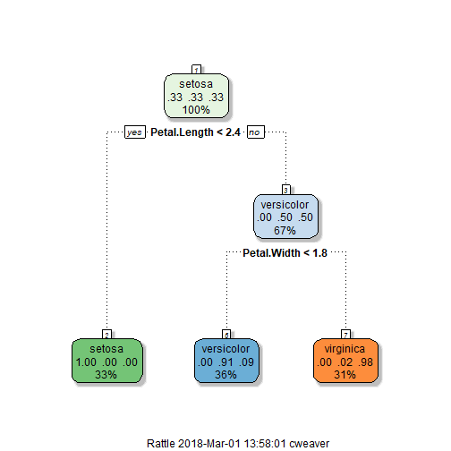

A Quick Intro to R
========================================================
author: Digital Insights Department Meeting
date: March 1, 2018
autosize: true

Agenda
========================================================

- Algorithms are easy!  
- Exploratory Data Analysis is *Interesting*  
- R Examples  
    - RMarkdown
    - Interesting Table Formatting
    - R Visualizations


A Decision Tree
========================================================

```r
modFit<-caret::train(Species~., method = "rpart", data=iris)
```

That's it!

If it is so easy, why does it seem to take a long time?

It's the data, stupid!

***




Exploratory Data Analysis (EDA)
========================================================
Getting *good* data is the hard part of machine learning

- Data is messy
- Data is incomplete
- Clients never know the problems they have - none of them!
- Fix the data, organize the data, manage outliers and missing data

RMarkdown Examples
===============================

- A quick review of the ClubReady RMarkdown file - significant effort
- A short RMarkdown file example


Table Format Example
==============================

Microsoft designed a table layout for reporting statistical analysis results.

**R is my hammer** - it does everything!  Faithfully reproduced the format the client requested (OK, it is a bit better than what they asked for ;)

R Visualizations
================================

- R visualizations are unmatched - really!
- WSJ, HBR and USA Today all use R visualizations
- Try this is Power BI!
