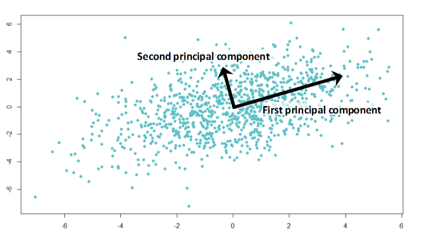

<style type="text/css">
p{ /* Normal  */
   font-size: 12px;
}
body{ /* Normal  */
   font-size: 12px;
}
td {  /* Table  */
   font-size: 10px;
}
h1 { /* Header 1 */
 font-size: 26px;
 color: #4294ce;
}
h2 { /* Header 2 */
 font-size: 22px;
}
h3 { /* Header 3 */
 font-size: 18px;
}
code.r{ /* Code block */
  font-size: 10px;
}
pre { /* Code block */
  font-size: 10px
}
#table-of-contents h2 {
background-color: #4294ce;
}
#table-of-contents{
background: #688FAD;
}
#nav-top span.glyphicon{
color: #4294ce;
}
#postamble{
background: #4294ce;
border-top: ;
}
</style>


```{r echo=FALSE, warning=FALSE, message=FALSE}
if(!require(easypackages)){install.packages("easypackages")}
library(easypackages)
packages("caret", "plyr", "car", "dplyr", "FactoMineR", "factoextra", "dummies", "PCAmixdata", prompt = FALSE)
```

# Introduction

It is typically a challenge to find the optimal method to reduce the dimensionality of mixed data.  If all the data is numeric, then PCA is a clear and obvious choice.  If all the data is categorical, then MCA would be a potential solution.  What do you do when the data has both numeric and categorical data - like most data do?

There are difference approaches.  The best solution is to use different models to identify the principle components and test these on the models that get created later.  Let the model performance determine the optimal solution.

There are 3 methodologies that could be used:

1. PCA and Dummy Variables / One Hot Encoding - this is the most-used solution's (but not necessarily the best one)
2. [Factor Analysis For Mixed Data](https://www.rdocumentation.org/packages/FactoMineR/versions/1.36/topics/FAMD)
3. [Principal component analysis of mixed data](https://cran.r-project.org/web/packages/PCAmixdata/PCAmixdata.pdf)

## Get Data

```{r}
#load train and test file
train <- read.csv("./data/train_Big.csv")
test <- read.csv("./data/test_Big.csv")

#add a column
test$Item_Outlet_Sales <- 1#so the rbind works

#combine the data set
combi <- rbind(train, test)

#impute missing values with median
combi$Item_Weight[is.na(combi$Item_Weight)] <- median(combi$Item_Weight, na.rm = TRUE)

#impute 0 with median
combi$Item_Visibility <- ifelse(combi$Item_Visibility == 0, median(combi$Item_Visibility), combi$Item_Visibility)

#find mode and impute
table(combi$Outlet_Size, combi$Outlet_Type)
levels(combi$Outlet_Size)[1] <- "Other"

# Removing the dependent (response) variable and other identifier variables( if any). We are practicing an unsupervised learning technique, hence response variable must be removed.

#remove the dependent and identifier variables
my_data <- subset(combi, select = -c(Item_Outlet_Sales, Item_Identifier, Outlet_Identifier))
```

Each of these are demonstrated below.

# PCA and Dummy Variables / One Hot Encoding

## Quick Intro to PCA

A principal component is a normalized linear combination of the original predictors in a data set. 

The **first principal component** is a linear combination of original predictor variables which captures the maximum variance in the data set. It determines the direction of highest variability in the data. Larger the variability captured in first component, larger the information captured by component. No other component can have variability higher than first principal component.

The first principal component results in a line which is closest to the data i.e. it minimizes the sum of squared distance between a data point and the line.

The **second principal component** is also a linear combination of original predictors which captures the remaining variance in the data set and is uncorrelated. In other words, the correlation between first and second component should is zero. 

If the two components are uncorrelated, their directions should be orthogonal (image below). This image is based on a simulated data with 2 predictors. Notice the direction of the components, as expected they are orthogonal. This suggests the correlation b/w these components in zero.

All succeeding principal component follows a similar concept i.e. they capture the remaining variation without being correlated with the previous component. 

The directions of these components are identified in an unsupervised way i.e. the response variable(Y) is not used to determine the component direction. Therefore, it is an unsupervised approach.

```{r, out.width = "300px", echo=FALSE}

```

> Partial least square (PLS) is a supervised alternative to PCA. PLS assigns higher weight to variables which are strongly related to response variable to determine principal components.

## Preparing for PCA

Since PCA works on numeric variables, let’s see if we have any variable other than numeric.

```{r}
str(my_data)
```

6 out of 9 variables are categorical in nature.  Convert these categorical variables into numeric using one hot encoding.

There are two methods presented:  using the `dummies` package and the other using the `dummyVars` function from `caret`.  I usually like to use `caret` whenever I can but in this case, `dummies` is much easier.

```{r using_dummies}
new_my_data <- dummy.data.frame(my_data, names = c("Item_Fat_Content","Item_Type", "Outlet_Establishment_Year","Outlet_Size", "Outlet_Location_Type","Outlet_Type"))
```

Typically, dummyVars works great but in this example because one variable started as an int when it was really a factor, it created challenges that are best avoided.

```{r using_caret}
#typically you would enter: new_my_data2 <- dummyVars(~. , my_data) but that will not convert Outlet_Establishment_Year because it is an int
#Therefore, need to handle this
my_data2 <- my_data
my_data2$Outlet_Establishment_Year <- as.factor(my_data2$Outlet_Establishment_Year)
str(my_data2)
new_my_data2 <- dummyVars(~., my_data2)
new_my_data2 <- data.frame(predict(new_my_data2, my_data2))
```

Now have all the numerical values. Re-divide the data into test and train.

```{r}
pca.train <- new_my_data[1:nrow(train),]
pca.test <- new_my_data[-(1:nrow(train)),]
```

The base R `prcomp` is used to perform PCA. By default, it centers the variable to have mean equals to zero. With parameter scale. = T, we normalize the variables to have standard deviation equals to 1.

```{r}
prin_comp <- prcomp(pca.train, scale. = T)
```

The goal to find the components which explain the maximum variance. This is because, we want to retain as much information as possible using these components. So, higher is the explained variance, higher will be the information contained in those components.

To compute the proportion of variance explained by each component, we simply divide the variance by sum of total variance.

```{r}
#compute standard deviation of each principal component
std_dev <- prin_comp$sdev
#compute variance
pr_var <- std_dev^2
#proportion of variance explained
prop_varex <- pr_var/sum(pr_var)
prop_varex[1:20]
```

This shows that first principal component explains 10.3% variance. Second component explains 7.3% variance. Third component explains 6.2% variance and so on. So, how do we decide how many components should we select for modeling stage?  A scree plot is used to access components or factors which explains the most of variability in the data. It represents values in descending order.

```{r}
plot(prop_varex, xlab = "Principal Component", ylab = "Proportion of Variance Explained", type = "b")
```

The plot above shows that ~ 30 components explains around 98.4% variance in the data set. In order words, using PCA we have reduced 44 predictors to 30 without compromising on explained variance. This is the power of PCA.  Confirm by plotting a cumulative variance plot. This will give us a clear picture of number of components.

```{r}
#cumulative scree plot
plot(cumsum(prop_varex), xlab = "Principal Component", ylab = "Cumulative Proportion of Variance Explained", type = "b")
```

This plot shows that 30 components results in variance close to ~ 98%. Therefore, in this case, we’ll select number of components as 30 [PC1 to PC30] and proceed to the modeling stage. This completes the steps to implement PCA on train data. For modeling, we’ll use these 30 components as predictor variables and follow the normal procedures.

Continue to modeling in the Appendix
https://www.analyticsvidhya.com/blog/2016/03/practical-guide-principal-component-analysis-python/

I think that was too much code for the PCA analysis.  Use `FactomineR` to faster results.

```{r factomineR}
results_pca <- PCA(pca.train, graph = FALSE)
fviz_eig(results_pca, addlabels = TRUE, nc=35)
```

Of course you can also to the eigenvalues that describe the variance explained by each dimension.

```{r}
results_pca$eig
```

FactoMineR does much more.  See Appendix

# Factor Analysis For Mixed Data

## Introduction to FAMD

Factor Analysis For Mixed Data (FAMD) is a principal component method dedicated to explore data with both continuous and categorical variables. It can be seen roughly as a mixed between PCA and MCA. More precisely, the continuous variables are scaled to unit variance and the categorical variables are transformed into a disjunctive data table (crisp coding) and then scaled using the specific scaling of MCA. This ensures to balance the influence of both continuous and categorical variables in the analysis. It means that both variables are on a equal foot to determine the dimensions of variability. This method allows one to study the similarities between individuals taking into account mixed variables and to study the relationships between all the variables. It also provides graphical outputs such as the representation of the individuals, the correlation circle for the continuous variables and representations of the categories of the categorical variables, and also specific graphs to visualize the associations between both type of variables.

```{r}
result_FAMD <- FAMD(my_data, graph = FALSE)
fviz_screeplot(result_FAMD, ncp=35)
result_FAMD$eig

```

While the results are disappointing (28.3% variance explained), this is likely due to the fact there were only 9 variables to begin with. (Not exactly a high dimensional problem!)  This does not invalidate the tool.  If were were to use a different data set, the results are much improved as shown below.  Note, it is trial an error to select the variables that provide the greatest cumulative percentage of variance.  It helps to consider the plot with the most influential variables as well and the impact of variables on each dimension.  You cam also create a DF (like the one below - contrib) and evaluate the dimensions with the highest values.

This is how the df below was created.

```{r}
data(wine)
str(wine)

result_FAMD2 <- FAMD(wine, graph = FALSE)
fviz_screeplot(result_FAMD2, ncp=10)
result_FAMD2$eig

fviz_famd_var(result_FAMD2, "quanti.var", repel = TRUE, col.var = "contrib", gradient.cols=c("#00AFBB", "#E7B800", "#FC4E07"))

fviz_famd_var(result_FAMD2, repel = TRUE)
fviz_contrib(result_FAMD2, "var", axes = 1)
fviz_contrib(result_FAMD2, "var", axes = 2)
fviz_contrib(result_FAMD2, "var", axes = 3)
fviz_contrib(result_FAMD2, "var", axes = 4)

quanti.var <- get_famd_var(result_FAMD2, "quanti.var")
quanti.var$contrib

contrib <- as.data.frame(quanti.var$contrib)
```

```{r}
df <- wine[, c(1, 2, 16, 22, 25, 26, 29, 28, 29, 30, 31)]
result_FAMD3 <- FAMD(df, graph = FALSE)
result_FAMD3$eig
fviz_screeplot(result_FAMD3, ncp=10)
```


# Principal Component Analysis of Mixed Data - PCAmixdata

Performs principal component analysis of a set of individuals (observations) described by a mixture of qualitative and quantitative variables. PCAmix includes ordinary principal component analysis (PCA) and multiple correspondence analysis (MCA) as special cases.

```{r}
#PCAMIX:
X.quanti <- splitmix(wine)$X.quanti
X.quali <- splitmix(wine)$X.quali
pca<-PCAmix(X.quanti[,1:27],X.quali,ndim=4)
pca<-PCAmix(X.quanti[,1:27],X.quali,ndim=4,graph=FALSE)
pca$eig

```

# LDA


============

# Appendix

## Model using pCA Results

https://www.analyticsvidhya.com/blog/2016/03/practical-guide-principal-component-analysis-python/

## Do More with FactomineR

fviz_contrib(results_pca, choice = "var", axes = 1:3, top = 10) - See book page 26

## PCAmixdata

---
title: "How to use the PCAmixdata Package"
author: "Marie Chavent"
---

```{r setup, include=FALSE}
knitr::opts_chunk$set(echo = TRUE,eval=TRUE,fig.align="center",fig.width = 7,fig.height = 6)
```

## Introduction to teh Data

gironde is a list of 4 datasets characterizing conditions of life of 542 cities in Gironde. The four datasets correspond to four thematics relative to conditions of life. Each dataset contains a different number of variables (quantitative and/or qualitative). The first three datasets come from the 2009 population census realized in Gironde by INSEE (Institut National de la Statistique et des Etudes Economiques). The fourth come from an IGN (Institut National de l'Information Geographique et forestiere) database.


1. **gironde$employment**:  This data frame contains the description of 542 cities by 9 quantitative variables. These variables are related to employment conditions like, for instance, the average income (income), the percentage of farmers (farmer).
2. **gironde$housing**:  This data frame contains the description of 542 cities by 5 variables (2 qualitative variables and 3 quantitative variables). These variables are related to housing conditions like, for instance, the population density (density), the percentage of counsel housing within the cities (council).
3. **gironde$services**: This data frame contains the description of 542 cities by 9 qualitative variables. These variables are related to the number of services within the cities, like, for instance, the number of bakeries (baker) or the number of post office (postoffice).
4. **gironde$environment**: This data frame contains the description of 542 cities by 4 quantitative variables. These variables are related to the natural environment of the cities, like, for instance the percentage of agricultural land (agricul) or the percentage of buildings (building).

##PCAmix

The datatable __housing__ is used.
```{r}
library(PCAmixdata)
data(gironde)
head(gironde$housing)
```

The __PCAmix__ function is applied to this datatable.
```{r}
split <- splitmix(gironde$housing)
X1 <- split$X.quanti 
X2 <- split$X.quali 
res.pcamix <- PCAmix(X.quanti=X1, X.quali=X2, rename.level=TRUE, graph=FALSE)
```
The object __res.pcamix__ contains many numerical results summarized in the S3 __print__ method.
```{r}
res.pcamix
```

The variance of the principal components is obtained.
```{r}
res.pcamix$eig
```

### Graphical outputs
Here are some graphical outputs.

```{r,fig.width = 10,fig.height = 10}
par(mfrow=c(2,2))
plot(res.pcamix,choice="ind",coloring.ind=X2$houses,label=FALSE, posleg="bottomright", main="Observations")
plot(res.pcamix,choice="levels",xlim=c(-1.5,2.5), main="Levels")
plot(res.pcamix,choice="cor",main="Numerical variables")
plot(res.pcamix,choice="sqload",coloring.var=T, leg=TRUE, posleg="topright", main="All variables")
```

It is also possible to select some observations to plot.
```{r,fig.width = 5,fig.height = 5}
sort(res.pcamix$ind$coord[,2])[1:10]
plot(res.pcamix,choice="ind",lim.contrib.plot = 2, posleg="bottomright", main="Observations",cex=0.8)
```

### Prediction and plot of new observations.
We select randomly 100 observations to build a test sample. The remaining observations are in a train sample used to perform __PCAmix__.

```{r}
set.seed(10)
test <- sample(1:nrow(gironde$housing),100)
train.pcamix <- PCAmix(X1[-test,],X2[-test,],ndim=2,graph=FALSE)
```
The scores of the 100 observations are obtained with the S3 method __predict.PCAmix__. 

```{r}
pred <- predict.PCAmix(train.pcamix,X1[test,],X2[test,])
head(pred)
```

It is then possible to plot these observation as supplementary on the principal component map.

```{r,fig.width = 5,fig.height = 5}
plot(train.pcamix,axes=c(1,2),label=FALSE,main="Observations map")
points(pred,col=2,pch=16)
legend("bottomright",legend = c("train","test"),fill=1:2,col=1:2)
```

##PCArot

We apply here the function __PCArot__ to perform varimax-type rotation to the result of __PCAmix__ applied to the datatable __housing__. The 10 first observations are removed to illustrate later the prediction of new observations.

```{r}
data(gironde)
#Create the datatable housing without the ten first observations
train <- gironde$housing[-c(1:10), ]
#Split the datatable
split <- splitmix(train)
X1 <- split$X.quanti 
X2 <- split$X.quali 
res.pcamix <- PCAmix(X.quanti=X1, X.quali=X2,rename.level=TRUE, graph=FALSE)
```
In order to choose the number of dimension to rotate, we look at the inertia of the principal components again.
```{r}
res.pcamix$eig 
```
We decide to rotate 3 principal components that summarize  84% of the inertia.

```{r}
res.pcarot <- PCArot(res.pcamix,dim=3,graph=FALSE)
res.pcarot$eig #variance of the rotated PCs
sum(res.pcarot$eig[,2]) #unchanged explained inertia
```
The object __res.pcarot__ contains many numerical results summarized in the S3 __print__ method.
```{r}
res.pcarot
```
We can look at the squared loadings before and after rotation.
```{r}
round(res.pcamix$sqload[,1:3],digit=2)
round(res.pcarot$sqload,digit=2)
```

### Graphical outputs
It is also possible to plot all the standard maps of __PCAmix__ before and after rotation. For instance we can plot the observations and variables before and after rotation in the dimensions 1 and 3.

```{r,fig.width = 10,fig.height = 10}
par(mfrow=c(2,2))
plot(res.pcamix,choice="ind",label=FALSE,axes=c(1,3), main="Observations before rotation")
plot(res.pcarot,choice="ind",label=FALSE,axes=c(1,3), main="Observations after rotation")
plot(res.pcamix,choice="sqload", coloring.var=TRUE, leg=TRUE,axes=c(1,3), posleg="topleft", main="Variables before rotation", xlim=c(0,1), ylim=c(0,1))
plot(res.pcarot,choice="sqload", coloring.var=TRUE, leg=TRUE,axes=c(1,3),
     posleg="topright", main="Variables after rotation", xlim=c(0,1), ylim=c(0,1))
```

It also possible to plot the numerical variables (on the correlation circle) or the levels of the categorical variables.

```{r,fig.width = 10,fig.height = 10}
par(mfrow=c(2,2))
plot(res.pcamix,choice="cor", coloring.var=TRUE, leg=TRUE,axes=c(1,3), posleg="topright", main="Before rotation")
plot(res.pcarot,choice="cor", coloring.var=TRUE, leg=TRUE,axes=c(1,3), posleg="topright", main="After rotation")
plot(res.pcamix,choice="levels",  leg=TRUE,axes=c(1,3), posleg="topright", main="Before rotation",xlim=c(-1.5,2.5))
plot(res.pcarot,choice="levels", leg=TRUE,axes=c(1,3), posleg="topright", main="After rotation",xlim=c(-1.5,2.5))
```

### Prediction and plot of new observations.
It is possible, exactly as in __PCAmix__, to predict the scores of new observations on the principal components after rotation.

```{r}
test <- gironde$housing[1:10, ]
splitnew <- splitmix(test)
X1new <- splitnew$X.quanti
X2new<-splitnew$X.quali
pred.rot <- predict(object=res.pcarot, X.quanti=X1new, X.quali=X2new)
pred.rot
```
An of course these new observations can be plot as supplementary observations on the principal component map of the observations after rotation.

```{r,fig.width = 5,fig.height = 5}
plot(res.pcarot,axes=c(1,3),label=FALSE,main="Observations map after rotation")
points(pred.rot[,c(1,3)],col=2,pch=16)
legend("topright",legend = c("train","test"),fill=1:2,col=1:2)
```

#MFAmix
We use here the 4 mixed datatables available in the dataset __gironde__. This dataset is a list of 4 datatables (one datatable by group).

```{r} 
library(PCAmixdata)
data(gironde)
names(gironde)
```

Then we apply the function __MFAmix__ to the four datatables concatenated in a single datatable.

```{r}
#Concatenation of the 4 datatables
dat <- cbind(gironde$employment,gironde$housing,gironde$services,gironde$environment) 
index <- c(rep(1,9),rep(2,5),rep(3,9),rep(4,4)) 
names <- c("employment","housing","services","environment") 
res.mfamix<-MFAmix(data=dat,groups=index, name.groups=names,ndim=3,rename.level=TRUE,graph=FALSE)
```

The object __res.mfamix__ contains many numerical results summarized in the S3 __print__ method.
```{r}
res.mfamix
```

### Graphical outputs
The graphical outputs of __MFAmix__ are quite similar to those of __PCAmix__ with some specifity introduced by the knowedge of groups of variables.

```{r,fig.width = 10,fig.height = 10}
par(mfrow=c(2,2))
plot(res.mfamix, choice="cor",coloring.var="groups",leg=TRUE, main="(a) Numerical variables")
plot(res.mfamix,choice="ind", partial=c("SAINTE-FOY-LA-GRANDE"), label=TRUE, posleg="topright", main="(b) Observations")
plot(res.mfamix,choice="sqload",coloring.var="groups", posleg="topright",main="(c) All variables")
plot(res.mfamix, choice="groups", coloring.var="groups", main="(c) Groups")
```

Because the correlation circle can be difficult to read with the superposition of the names of some variables, it can be useful to look at the numerical values the most correlated (in absloute value) to the 2 first principal components of __PCAmix__.

```{r}
coord.var <- res.mfamix$quanti$coord[,1:2]
subset(coord.var,abs(coord.var[,1])>0.5,1)
subset(coord.var,abs(coord.var[,2 ])>0.5,2)
```

In order to have details on the way the variables of the group __services__ (in blue on the map of all the variables) interpret the first principal component, we look at the map the levels of the categorical variables;

```{r,fig.width = 7,fig.height = 5}
plot(res.mfamix, choice="levels", coloring.var="groups", posleg="bottomleft", main="(c) Levels",xlim=c(-2,4))
```

