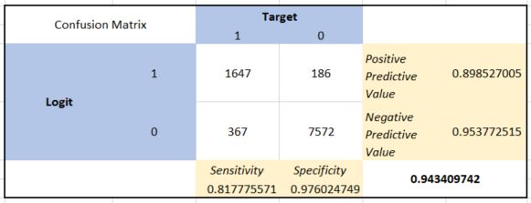

<style type="text/css">
p{ /* Normal  */
   font-size: 14px;
   line-height: 18px;
}
body{ /* Normal  */
   font-size: 14px;
}
td {  /* Table  */
   font-size: 12px;
}
h1 { /* Header 1 */
 font-size: 26px;
 color: #4294ce;
}
h2 { /* Header 2 */
 font-size: 22px;
}
h3 { /* Header 3 */
 font-size: 18px;
}
code.r{ /* Code block */
  font-size: 12px;
}
pre { /* Code block */
  font-size: 12px
}
#table-of-contents h2 {
background-color: #4294ce;
}
#table-of-contents{
background: #688FAD;
}
#nav-top span.glyphicon{
color: #4294ce;
}
#postamble{
background: #4294ce;
border-top: ;
}
</style>

```{r echo=FALSE, warning=FALSE, message=FALSE}
if(!require(easypackages)){install.packages("easypackages")}
library(easypackages)
packages("dplyr", "tidyr", "ggplot2", "ggvis", "corrplot", "DT","gridExtra", "caret", "rpart", 
         "rpart.plot", "e1071", "rminer", prompt = FALSE)
```

#Prologue

The document provides good examples of:

- A use case that can be applied to most organizations
- An introduction to a few common machine learning models
- Visualization including plotting and tables

# Use Case

Valorem is working for one of their larger clients that needs to understand why some of their best and most experienced employees are leaving prematurely. The company also wishes to predict which valuable employees will leave next.

Valorem and the company defined the goals for the engagement:

1. Understand why valuable employees leave
2. Predict who may leave next

Valorem worked with the HR department to gather collect and understand data about the employees.

Unfortunately, company managers do not keep records why people leave - a common occurrence.  Valorem will examine the data to see if the data can provide clues why some employees sought opportunities elsewhere.

# The Data

The HR Department provided the data to Valorem.  The data included:

- satisfaction level
- latest annual evaluation results
- number of project worked
- average monthly hours
- tenure with company
- work accident within past 2 years
- promotion within the past 5 years
- department
- salary

Here is a glimpse of the source data:

```{r, echo=F, message=F, warning=F}
hr = read.table('./data/HR.csv', header = T, sep = ';')
# Order the salary factor
hr$salary <- factor(hr$salary, levels = c("low", "medium", "high"))
head(hr)
```

`r nrow(hr)` employee records are available for analysis.  Valorem is pleased - the more data there is to evaluate, the better the change to find a solution for the company!

## Data Analysis

Before changing any data, Valorem collects basic statistics on the raw data:
This table describe the characteristics of each features of our ABT. We can see different statistical measures of central tendency and variation. For example we can see that our attrition rate is equal to 24%, the satisfaction level is around 62% and the performance average is around 71%. We see that on average people work on 3 to 4 projects a year and about 200 hours per months.

```{r, echo=F, message=F, warning=F}
knitr::kable(summary(hr))
#summary(hr)
```

Quickly, Valorem begins to get an understanding of the data.  For example, Valorem learns 

- The attrition rate is 24%
- Satisfaction level is ~62%
- Performance average is ~71%
- On average people work on 3 to 4 projects a yea
- On average the company resources work ~200 hours each month

### Correlation

Moving beyond a traditional statistics view of the data, Valorem sought to compare the data variables to one and other to determine which were correlated with one and other.  This can provide important data insights that traditional statics does not provide.

In the correlation plot below, the size of the bubbles reveal the significance of the correlation.  The color of the bubbles illustrate the direction (either positively or negatively correlated).

```{r, message=F, warning=F, fig.width=10}
HR_correlation <- hr %>% select(satisfaction_level:promotion_last_5years)
M <- cor(HR_correlation)
corrplot.mixed(M, lower.col = "black", number.cex = .8, tl.pos = "lt", tl.cex = .7)
```

The data drives a few conclusions. On average, company resources that leave on their own accord:

- have a low satisfaction level
- work more
- did not get promoted within the past five years

This answers the first goal stated at the beginning of the project:  *Understand why valuable employees leave*.  To begin answering the second goal, *Predict who may leave next*, Valorem continues the data analysis below.

## Who Leaves?

To predict who *might* leave, Valorem must first understand who has already left.

Create a data frame with only the people that have left the company so we can visualize the distribution of each the features:

```{r, message=F, warning=F, fig.width=10}
hr_hist <- hr %>% filter(left == 1)

p1 <- ggplot(hr_hist, aes(satisfaction_level)) + geom_histogram(bins = 20, col = "darkblue", aes(fill = ..count..)) +
  xlab("Statisfaction") + ggtitle("Satisfaction Distribution") + theme(legend.position=c(0.9, .85),  
  legend.background = element_rect(fill = "transparent"))
p2 <- ggplot(hr_hist, aes(last_evaluation)) + geom_histogram(bins = 20, col = "darkblue", aes(fill = ..count..)) +
  xlab("Statisfaction") + ggtitle("Satisfaction Distribution") + theme(legend.position=c(0.9, .85),  
  legend.background = element_rect(fill = "transparent"))
p3 <- ggplot(hr_hist, aes(average_montly_hours)) + geom_histogram(bins = 20, col = "darkblue", aes(fill = ..count..)) +
  xlab("Statisfaction") + ggtitle("Satisfaction Distribution") + theme(legend.position=c(0.9, .85),  
  legend.background = element_rect(fill = "transparent"))
grid.arrange(p1, p2, p3, ncol=3)
```

As in all organizations, Some people just do not work well in the company's environment.  This is an expected and recurring problem for most businesses.  However, in this case, it appears too many top performers have decided to find new opportunities.

```{r, message=F, warning=F, fig.width=10}
par(mfrow=c(1,2))

p4 <- ggplot(hr_hist, aes(as.factor(Work_accident))) + geom_bar(stat="count", col = "darkblue", fill = "#3090C7") +
  theme(axis.title.x = element_blank(), axis.text.x=element_blank(), axis.ticks.x=element_blank()) + 
  ggtitle("Work Accidents Distribution") + ylab("Frequency") + theme(legend.position=c(0.9, .85),  
  legend.background = element_rect(fill = "transparent")) + annotate("text", x=1, y=2000, label = "No Accidents Reported") + 
  annotate("text", x=2, y=90, label = "Accidents Reported")

p5 <- ggplot(hr_hist, aes(salary)) + geom_bar(col = "darkblue", fill = "#3090C7") + xlab("Salary") + ylab("Frequency") +
  ggtitle("Salary Distribution") +
  theme(axis.title.x = element_blank(), axis.text.x=element_blank(), axis.ticks.x=element_blank()) + 
  annotate("text", x=1, y=1250, label = "Salary - Low") + annotate("text", x=2, y=700, label = "Salary - Medium") +
  annotate("text", x=3, y=50, label = "Salary - High")

grid.arrange(p4, p5, ncol = 2)
```

Out of the `r nrow(hr)` employee records, `r nrow(hr %>% filter(left == 1))` left the company.  

It is more helpful to calculate the number of employees that received a better-than-average review, whose tenure was at least 4 years, or that working on more than 5 projects at the same time and still have left the company. **These are the people the company would want to retain.**

## Why Top Performers Leave?

Losing over 2,000 high-performing resources is painful to any company.  Valorem performed additional analysis to try to uncover the reasons these high-performers may have left.  With this information, the company will become better equipped to identify and retain high-performing employees that have a high likelihood to leave if there is no intervention.

We learn below on average valuable employees that leave are:

- not satisfied
- work on many projects
- spend many hours working each month
- fail to get promoted 

```{r, message=F, warning=F, fig.width=10}
hr_good_leaving_people2 <- hr %>% filter(last_evaluation >= 0.70 | time_spend_company >= 4 | number_project > 5)
hr_good_people_select <- hr_good_leaving_people2 %>% select(satisfaction_level, number_project: promotion_last_5years)
M <- cor(hr_good_people_select)
corrplot.mixed(M, lower.col = "black", number.cex = .8, tl.pos = "lt", tl.cex = .7)
```

```{r, calcModelData, warning=F, results='hide', echo=FALSE}
hr_model <- hr %>% filter(last_evaluation >= 0.70 | time_spend_company >= 4 | number_project > 5)
```

# Predictive Modeling

The goal of any modern data analysis is to gain insight and predict future events so they can be managed.  Valorem has developed insights from the company data.  Valorem next experiments with a variety of machine learning algorithms to help the company identify top performers who are at risk of leaving the company's employ.

After configuring cross-validation, Valorem builds and compare different predictive models.  Do not know what `cross validation` is?  Do not worry.  Valorem introduces it below.  It is simply a technique to help ensure our model results are more accurate when introduced to new data the model has not evaluated before.

Valorem has also provided a quick summary of each of the models evaluated.

- Decision Tree
- Naive Bayes
- Logistic Regression

## Brief Introduction to Cross Validation

Cross Validation is a technique that reserves a sample of a dataset which you do not use to train the model. Later, test the model on this sample before finalizing the model. This helps ensure your model is not over fitted to the train data and helps improve model accuracy when processing new data. 

1. Randomly split your entire dataset into k”folds”.
2. For each k folds in your dataset, build your model on k – 1 folds of the data set. Then, test the model to check the effectiveness for kth fold.
3. Record the error you see on each of the predictions.
3. Repeat this until each of the k folds has served as the test set.

The average of your k recorded errors is called the cross-validation error and will serve as your performance metric for the model.

The results from the code illustrated below are not presented - the results would not be helpful (unless you are a data scientist too!)

```{r, crossValidation, warning=F, results='hide'}
# Set the target variable as a factor
hr_model$left <- as.factor(hr_model$left)
# cross-validation
train_control <- trainControl(method = "cv", number = 5, repeats = 3)
head(train_control)
```

## Interpreting Modeling Results

Each of the models below result in large and varied outputs.  Most of the output is interesting only to data scientists.  However, the company needs to understand the results too.  Valorem condenses the output into what data science calls confusion matrices.  Do not worry, for this example, it will not be confusing.

A confusion matrix is simply a table that is used to describe the performance of a classification model (or "classifier") on a set of test data for which the true values are known. 

In each confusion matrix below, pay attention to the **bolded value** in the lower right.  The is the accuracy of the model.  While there are many metrics used to evaluate model performance, in this example, Valorem will use accuracy as the metric to compare model performance.  

## Decision Tree Modeling

Decision trees are applied to situation where data is divided into groups rather than evaluating a numerical response and its relationship to a set of descriptor variables. 

```{r, decisionTree, warning=F, results='hide', message=FALSE}
# train the model 
rpartmodel <- train(left~., data = hr_model, trControl = train_control, method = "rpart")
# make predictions
predictions_rpart <- predict(rpartmodel, hr_model)
hr_model_tree <- cbind(hr_model, predictions_rpart)
# summarize results
confusionMatrix <- confusionMatrix(hr_model_tree$predictions, hr_model_tree$left)
confusionMatrix
```

```{r rocDecision, message=FALSE, warning=FALSE, include=FALSE}
library("ROCR")
hr_model_tree$predictions <- as.numeric(paste(hr_model_tree$predictions))

perf.obj_rpart <- prediction(predictions=hr_model_tree$predictions, labels=hr_model_tree$left)
# Get data for ROC curve
roc.obj_rpart <- performance(perf.obj_rpart, measure="tpr", x.measure="fpr")
plot(roc.obj_rpart,
     main="Cross-Sell - ROC Curves",
     xlab="1 – Specificity: False Positive Rate",
     ylab="Sensitivity: True Positive Rate",
     col="blue")
abline(0,1,col="grey")
```
 

## Naives Bayes Modeling

Naive Bayes classification is a kind of simple probabilistic classification methods based on Bayes’ theorem with the assumption of independence between features. Bayes’ theorem can be used to make prediction based on prior knowledge and current evidence. With accumulating evidence, the prediction is changed. Under some circumstances, this is a fast and accurate classifier.

```{r, echo=F, warning=F}
library(e1071)
library(rminer)
```

```{r, naiveBayes, message=FALSE, warning=FALSE, results='hide', cache=TRUE}
# train the model 
e1071model2 <- train(left~., data = hr_model, trControl = train_control, method = "nb")
# make predictions
predictions_NB <- predict(e1071model2, hr_model)
e1071modelbinded <- cbind(hr_model, predictions_NB)
# summarize results
confusionMatrix <- confusionMatrix(e1071modelbinded$predictions, e1071modelbinded$left)
confusionMatrix
```

```{r rocNB, message=FALSE, warning=FALSE, include=FALSE}
hr_model_tree$predictions <- as.numeric(paste(hr_model_tree$predictions))

perf.obj_NB <- prediction(predictions=hr_model_tree$predictions, labels=hr_model_tree$left)
# Get data for ROC curve
roc.obj_NB <- performance(perf.obj_NB, measure="tpr", x.measure="fpr")
plot(roc.obj_NB,
     main="Cross-Sell - ROC Curves",
     xlab="1 – Specificity: False Positive Rate",
     ylab="Sensitivity: True Positive Rate",
     col="blue")
abline(0,1,col="grey")

```
 

## Logistic Regression Modeling

Logistic regression is a regression analysis is often used when the output you seek is binary.  Like all regression analyses, logistic regression is a predictive analysis.  Logistic regression is used to describe data and to explain the relationship between one outcome variable and one or more variables.  Logistic Regression produces predictions resulting and either/or probabilities.

```{r, logistic, warning=F, results='hide'}
# train the model 
gmlmodel <- train(left~., data = hr_model, trControl = train_control, method = "LogitBoost")
# make predictions
predictions_glm <- predict(gmlmodel, hr_model)
gmlmodelbinded <- cbind(hr_model, predictions_glm)
# summarize results
confusionMatrix <- confusionMatrix(gmlmodelbinded$predictions, gmlmodelbinded$left)
confusionMatrix
```

```{r rocLogistics, message=FALSE, warning=FALSE, include=FALSE}
gmlmodelbinded$predictions <- as.numeric(paste(gmlmodelbinded$predictions))

perf.obj_glm <- prediction(predictions=gmlmodelbinded$predictions, labels=gmlmodelbinded$left)
# Get data for ROC curve
roc.obj_glm <- performance(perf.obj_glm, measure="tpr", x.measure="fpr")
plot(roc.obj_glm,
     main="Cross-Sell - ROC Curves",
     xlab="1 – Specificity: False Positive Rate",
     ylab="Sensitivity: True Positive Rate",
     col="blue")
abline(0,1,col="grey")

```
 

# Actionable Data Insights

The confusion matrix and the accuracy of the different model show the predictive power is very similar between the models. Each model is approximately 95% accurate.  (Kappa = 84%. Kappa Statistic compares the accuracy of the model to the accuracy of a random system.  A good metric to consider when evaluating confusion matrices.) Because logistic regression is fast and widely adopted, Valorem select the logistic regression model for predictions. 

## Predictions

Valorem uses the logistic model to plot the predictions of the company's employees and their predicted likelihood to leave.  In this plot, the likelihood to leave is compared to the individual performance of the employee.  Keep focus on the top right of the plot. This is where top performers are predicted to have relatively high likelihood to the company.

```{r, warning=F, fig.width=10}
set.seed(100)
# Keep some data to test again the final model
inTraining <- createDataPartition(hr_model$left, p = .75, list = FALSE)
training <- hr_model[inTraining, ]
testing  <- hr_model[-inTraining, ]
# Estimate the drivers of attrition
logreg = glm(left ~ ., family = binomial(logit), data = training)
# Make predictions on the out-of-sample data
probaToLeave = predict(logreg, newdata = testing, type = "response")
# Structure the prediction output in a table
probToLeave_df = data.frame(probaToLeave)
# Add a column to the probToLeave_df dataframe containing the performance
probToLeave_df$performance = testing$last_evaluation

ggplot(probToLeave_df, aes(probaToLeave, performance)) + 
  geom_point(col = ifelse(probaToLeave > .74 & probToLeave_df$performance > .74, "red", "blue")) + 
  labs(title = "Company Employee Retention Program", subtitle = "At Risk Employees", x = "Liklihood to Leave", y = "Individual Annual Performance") +
  theme(plot.subtitle=element_text(color="red"))
```

While a visualization is helpful to understand the big picture, providing the discrete data is more actionable.  For example, the information provided below could be grouped by department so department managers could intervene with these top performers.

```{r, warning=F, fig.width=10}
probToLeave_df$priority = probToLeave_df$performance*probToLeave_df$probaToLeave
orderprobToLeave_df = probToLeave_df[order(probToLeave_df$priority, decreasing = TRUE),]
orderprobToLeave_df <- head(orderprobToLeave_df, n = 300)
datatable(orderprobToLeave_df)
```

# Conclusion

Recall the goals of the project:

Valorem and the company defined the goals for the engagement:

1. Understand why valuable employees leave
2. Predict who may leave next

Valorem identified the primary reasons high performing employees the the company.  Once these reasons were identified, a machine learning model was created to predict what current high performers are at the greatest risk of leaving the company.  The data can be used by HR and company managers to intervene and reduce the loss of high performers.

# Appendix

Above, Valorem used `accuracy` as the performance metric to compare model results.  Another common method us comparing ROC Curves.  The Receiver Operating Characteristic (ROC) curve is a technique that is widely used in machine learning experiments. ROC curve is a graphical plot that summarizes how a classification system performs and allows us to compare the performance of different classifiers.

The ROC is a graphical representation of the classifier performance. The area under the curves (AUC) produces as value that allows the classifier to be compared.

Because the classifiers perform nearly equally, the ROC Curves overlap.  Therefore, in this specific case, the ROC visualization is not helpful.  Note below the decision tree and Naive Bayes ROC overlap completely.

```{r}
{
plot(roc.obj_rpart, col = "blue")
plot(roc.obj_glm, add=TRUE, col = "green")
plot(roc.obj_NB, add=TRUE, col = "black")
}
```

