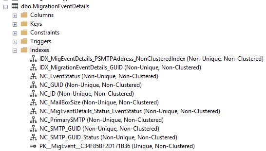
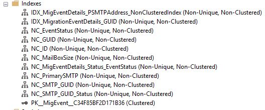
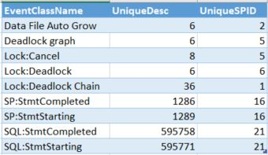

<style type="text/css">
p{ /* Normal  */
   font-size: 12px;
}
body{ /* Normal  */
   font-size: 12px;
}
td {  /* Table  */
   font-size: 10px;
}
h1 { /* Header 1 */
 font-size: 26px;
 color: #4294ce;
}
h2 { /* Header 2 */
 font-size: 22px;
}
h3 { /* Header 3 */
 font-size: 18px;
}
code.r{ /* Code block */
  font-size: 10px;
}
pre { /* Code block */
  font-size: 10px
}
#table-of-contents h2 {
  background-color: #4294ce;
}
#table-of-contents{
background: #688FAD;
}
#nav-top span.glyphicon{
  color: #4294ce;
}
#postamble{
  background: #4294ce;
border-top: ;
}
</style>


```{r echo=FALSE, warning=FALSE, message=FALSE}
if(!require(easypackages)){install.packages("easypackages")}
library(easypackages)
packages("plyr", "dplyr", "ggplot2", prompt = FALSE)
```

#Introduction

In October 2017, Valorem worked with Microsoft so triage a database that primarily supports Exchange to Office 365 mailbox migrations.  Other applications are also supported but the mailbox migration is the target feature of the project documented herein.  The database serves supports transaction and reporting functions.

A bit of history on the evolution of the target database:

- Database was originally implemented in MS Access to support Mailbox migrations 
- Database was migrated to SQL Server using the Upsizing Wizard but not optimized for SQL Server
- Performance was originally acceptable until Power BI workloads were introduced
- Data Volumes have grown to 14 Million rows in main transaction details tables
  - MigrationMaster
  - MigrationEventDetails
  - Customer_info
- Users of the client server tools are experiencing timeout and connection errors.

Some of the initial findings after a brief discovery period include:

- The database design has incorrectly implemented Primary / Foreign key indexes.
- The largest table MigrationEventDetails lacks a clustered index.
- The MigrationEventDetails table has multiple non clustered indexes defined on the heap.  As a result, all insert and update operations result in table locks.
- Most workloads require MigrationEventDetails to be joined to MigrationMaster table on a GUID value. This GUID value is stored in both tables as a nvarchar(255) and not as type GUID. Consequently, most workloads are resulting in full table scans of this largest table.
- The Power BI reports include a where clause for a specific GUID which requires a full table scan to process.

##Project Goal

> The immediate goal of this initial engagement is **triage** - minimize locks and timeouts while minimizing the impact to client tools.  

While it is tempting to fix root cause problems, some of these effort fall outside the scope of this project. Perhaps once application reliability is improved we can plan a more modern data platform approach to correct current design challenges and prepare the database for future stability and scalability.

The Team plans to identify 2-3 high value changes during the life of this initial project.  The project duration is scheduled for 7 weeks.

1. All clustered index to MigrationEventsDetail table
2. Need to define
3. Need to define

#Data Example Local dB

The methodology the project follows in one of testing and validation on a PreProd environment to demonstrate the effectiveness of proposed solutions.  If the data proves the value of a specific production modification, Microsoft will use its change management procedures to implement the improvements.

##Local Validation of Clustered Index

Before implementing a change in the PreProd environment, the recommended changes will be evaluated on a local copy of the database by Valorem.  The local database copy is not an exact replica of the production database but is close enough for initial evaluation.

###Step 1 - Load Local dB

The first step was to populate the database.  Valorem created executables that mimic production workloads.  The local database was populated with approximately 11M records in the MigrationEventDetails table.

###Step 2 - SQL Profiler

The workload executables were run again this time with SQL Profiler running the TSQL_Locks trace template.  Scans were added to the counters.

Profiler was run twice:  once with the nonclustered index on the MigrationEventsDetails table and again with a clustered index. 

  

In this first experiment, database locks were witnessed:

 

This provided encouraging news.  It appeared the workload executables were able to reproduce locks on the local database.

###Reproducibility

Further attempts to reproduce the locks failed.  Identical experiments were performed.  A new replica database to created and retested.  Multiple SQL Profiler templates were created and analyzed.  The database locks could not be recreated.

On Nov 7, 2017, Gourav (MS) demonstrated running just one high cost Power BI view will cause locks on the PreProd server.  (There are a large number of view no the production server.  Because of the sensitive nature of the content, Valorem was not provided access.)  One of these views, 
YTD, was included in the schema used to recreate the local database.  Several more experiments were performed after writing a query that would call the YTD view every 10 seconds while the workload executables ran.  This was performed in attempt to recreate the locks witnessed in PreProd.

Profile data was saved to a SQL Table. This was then used as the source data for a rudimentray analysis in R.  The results of this are presented below.

#Profile Data Analysis

```{r getSQLData, message=FALSE}
library(RODBC)
library (dplyr)
library(ggplot2)
library(gridExtra)
dbhandle <- odbcDriverConnect('driver={SQL Server};server=VCG-CWEAVER;database=SQLProfile;trusted_connection=true')
resClust <- sqlQuery(dbhandle, 'SELECT te.name as EventClassName
                ,[EventClass]
                ,[Duration]
                ,[EndTime]
                ,[TextData]
                ,[CPU]
                ,[Reads]
                ,[SPID]
                ,[StartTime]
                ,[Writes]
                FROM [SQLProfile].[dbo].[FTDB_Baseline_Clustered_YTD_11-8] as ftdb
                left join sys.trace_events as te
                on ftdb.EventClass = te.trace_event_id')

resNonClust <- sqlQuery(dbhandle, 'SELECT te.name as EventClassName
                ,[EventClass]
                     ,[Duration]
                     ,[EndTime]
                     ,[TextData]
                     ,[CPU]
                     ,[Reads]
                     ,[SPID]
                     ,[StartTime]
                     ,[Writes]
                     FROM [SQLProfile].[dbo].[FTDB_Baseline_Nonclustered_YTD_11-8] as ftdb
                     left join sys.trace_events as te
                     on ftdb.EventClass = te.trace_event_id')

#First record is all NA so remove
resClust <- resClust[3:nrow(resClust),]
resNonClust <- resNonClust[3:nrow(resNonClust),]

eventNameClust <- group_by(resClust, EventClassName)
eventNameNonClust <- group_by(resNonClust, EventClassName)

clustData <- summarize(eventNameClust, UniqueDesc = n(),  UniqueSPID = n_distinct(SPID), Duration = sum(as.numeric(Duration)))
NonClustData <- summarize(eventNameNonClust, UniqueDesc = n(),  UniqueSPID = n_distinct(SPID), Duration = sum(as.numeric(Duration)))

#Prep for plotting
clustData$IndexType <- "Clustered"
NonClustData$IndexType <- "NonClustered"

allData <- rbind(clustData, NonClustData)
eventclassnames <-  as.character(unique(allData$EventClassName))
#Remove the eventnames that are not too interesting (not high values)
# SP:StmtStarting (3), Data File Auto Grow (6), 
exclude <- c(eventclassnames[3], eventclassnames[6])
allData <- subset(allData, !EventClassName %in% exclude)
allData[is.na(allData)] <- 0
allData$EventClassName <- gsub(":", "_", allData$EventClassName)
```

A summary of the data is presented below:

```{r echo=FALSE}
allData
```

The same data visualized below:

```{r}
pScans <- ggplot(data=filter(allData, EventClassName=="Scan_Started"), aes(x=IndexType, y=UniqueDesc, fill=IndexType)) + 
  geom_bar(stat = "identity") + labs(title="Compare Scan Started Counts", y = "Scans Started")
  
pSQL_StmtCompleted <- ggplot(data=filter(allData, EventClassName=="SQL_StmtCompleted"), aes(x=IndexType, y=UniqueDesc, fill=IndexType)) + 
  geom_bar(stat = "identity") + labs(title="Compare SQL_StmtCompleted Counts", y = "SQL_StmtCompleted")

pSQL_StmtStarting <- ggplot(data=filter(allData, EventClassName=="SQL_StmtStarting"), aes(x=IndexType, y=UniqueDesc, fill=IndexType)) + 
  geom_bar(stat = "identity") + labs(title="Compare SQL_StmtStarting Counts", y = "SQL_StmtStarting")

pSP_StmtCompleted <- ggplot(data=filter(allData, EventClassName=="SP_StmtCompleted"), aes(x=IndexType, y=UniqueDesc, fill=IndexType)) + 
  geom_bar(stat = "identity") + labs(title="Compare SP_StmtCompleted Counts", y = "SP_StmtCompleted")
grid.arrange(pScans, pSP_StmtCompleted, pSQL_StmtStarting,pSQL_StmtCompleted)
```

#Conclusion

While the initial results were promising with first experiment capturing database locks, this enthusiasm quickly faded when they could not be reproduced.  Further, locks were not duplicated by directly calling a high cost view like can be witnessed on Microsoft Servers.  Lastly, the profile data collected on the local database does not raise any significant findings.

This leads to one conclusion:  

> The database schema used to create the local database does not adequately simulate the production server eliminating the opportunity to replicate the primary user issues of connection and query timeouts.

Recommendation:  Valorem requires access to the PreProd server and other servers that may be added to or replace the current pre-production database server (Always On, Read-Only, etc).

