```
## Removing package from 'C:/RPackages'
## (as 'lib' is unspecified)
```

```
## Installing package into 'C:/RPackages'
## (as 'lib' is unspecified)
```

# Task Summary


- The metadata (location, numerical columns, target, etc.) is - *"C:/Users/cweaver/Documents/Github/Valorem/TDSP/Report/para-adult_updated_updated.yaml"*
- The data location is - *../Data/Common/UCI_Income/train*
- The target is - *label_IsOver50K*
- The task type is - *classification*.
- The numerical variables are - *age, fnlwgt, educationnum, capitalgain, capitalloss, hoursperweek*
- The categorical variables are - *workclass, education, maritalstatus, occupation, relationship, race, sex, nativecountry, label_IsOver50K*


# Data Summary
## Take a peek of the data by showing the top rows of the data


```
##    age         workclass fnlwgt  education educationnum
## 1   39         State-gov  77516  Bachelors           13
## 2   50  Self-emp-not-inc  83311  Bachelors           13
## 3   38           Private 215646    HS-grad            9
## 4   53           Private 234721       11th            7
## 5   28           Private 338409  Bachelors           13
## 6   37           Private 284582    Masters           14
## 7   49           Private 160187        9th            5
## 8   52  Self-emp-not-inc 209642    HS-grad            9
## 9   31           Private  45781    Masters           14
## 10  42           Private 159449  Bachelors           13
##             maritalstatus         occupation   relationship   race     sex
## 1           Never-married       Adm-clerical  Not-in-family  White    Male
## 2      Married-civ-spouse    Exec-managerial        Husband  White    Male
## 3                Divorced  Handlers-cleaners  Not-in-family  White    Male
## 4      Married-civ-spouse  Handlers-cleaners        Husband  Black    Male
## 5      Married-civ-spouse     Prof-specialty           Wife  Black  Female
## 6      Married-civ-spouse    Exec-managerial           Wife  White  Female
## 7   Married-spouse-absent      Other-service  Not-in-family  Black  Female
## 8      Married-civ-spouse    Exec-managerial        Husband  White    Male
## 9           Never-married     Prof-specialty  Not-in-family  White  Female
## 10     Married-civ-spouse    Exec-managerial        Husband  White    Male
##    capitalgain capitalloss hoursperweek  nativecountry label_IsOver50K
## 1         2174           0           40  United-States               0
## 2            0           0           13  United-States               0
## 3            0           0           40  United-States               0
## 4            0           0           40  United-States               0
## 5            0           0           40           Cuba               0
## 6            0           0           40  United-States               0
## 7            0           0           16        Jamaica               0
## 8            0           0           45  United-States               1
## 9        14084           0           50  United-States               1
## 10        5178           0           40  United-States               1
```

## The dimensions of the data (Rows, Columns)


```
##   Number of Rows Number of Columns
## 1          32561                15
```

## Types of columns


```
##       Column_Name     Column_Type
##  [1,] "age"           "integer"  
##  [2,] "workclass"     "factor"   
##  [3,] "fnlwgt"        "integer"  
##  [4,] "education"     "factor"   
##  [5,] "educationnum"  "integer"  
##  [6,] "maritalstatus" "factor"   
##  [7,] "occupation"    "factor"   
##  [8,] "relationship"  "factor"   
##  [9,] "race"          "factor"   
## [10,] "sex"           "factor"
```

# Dive deeper into each individual variable
## More detailed statistics of each variable


```
## as.data.frame(data) 
## 
##  10  Variables      32561  Observations
## ---------------------------------------------------------------------------
## age 
##        n  missing distinct     Info     Mean      Gmd      .05      .10 
##    32561        0       73        1    38.58     15.4       19       22 
##      .25      .50      .75      .90      .95 
##       28       37       48       58       63 
## 
## lowest : 17 18 19 20 21, highest: 85 86 87 88 90
## ---------------------------------------------------------------------------
## workclass 
##        n  missing distinct 
##    32561        0        9 
## 
## ? (1836, 0.056), Federal-gov (960, 0.029), Local-gov (2093, 0.064),
## Never-worked (7, 0.000), Private (22696, 0.697), Self-emp-inc (1116,
## 0.034), Self-emp-not-inc (2541, 0.078), State-gov (1298, 0.040),
## Without-pay (14, 0.000)
## ---------------------------------------------------------------------------
## fnlwgt 
##        n  missing distinct     Info     Mean      Gmd      .05      .10 
##    32561        0    21648        1   189778   112348    39460    65716 
##      .25      .50      .75      .90      .95 
##   117827   178356   237051   329054   379682 
## 
## lowest :   12285   13769   14878   18827   19214
## highest: 1226583 1268339 1366120 1455435 1484705
## ---------------------------------------------------------------------------
## education 
##        n  missing distinct 
##    32561        0       16 
## 
## 10th (933, 0.029), 11th (1175, 0.036), 12th (433, 0.013), 1st-4th (168,
## 0.005), 5th-6th (333, 0.010), 7th-8th (646, 0.020), 9th (514, 0.016),
## Assoc-acdm (1067, 0.033), Assoc-voc (1382, 0.042), Bachelors (5355,
## 0.164), Doctorate (413, 0.013), HS-grad (10501, 0.323), Masters (1723,
## 0.053), Preschool (51, 0.002), Prof-school (576, 0.018), Some-college
## (7291, 0.224)
## ---------------------------------------------------------------------------
## educationnum 
##        n  missing distinct     Info     Mean      Gmd      .05      .10 
##    32561        0       16     0.95    10.08     2.75        5        7 
##      .25      .50      .75      .90      .95 
##        9       10       12       13       14 
##                                                                       
## Value          1     2     3     4     5     6     7     8     9    10
## Frequency     51   168   333   646   514   933  1175   433 10501  7291
## Proportion 0.002 0.005 0.010 0.020 0.016 0.029 0.036 0.013 0.323 0.224
##                                               
## Value         11    12    13    14    15    16
## Frequency   1382  1067  5355  1723   576   413
## Proportion 0.042 0.033 0.164 0.053 0.018 0.013
## ---------------------------------------------------------------------------
## maritalstatus 
##        n  missing distinct 
##    32561        0        7 
## 
## Divorced (4443, 0.136), Married-AF-spouse (23, 0.001), Married-civ-spouse
## (14976, 0.460), Married-spouse-absent (418, 0.013), Never-married (10683,
## 0.328), Separated (1025, 0.031), Widowed (993, 0.030)
## ---------------------------------------------------------------------------
## occupation 
##        n  missing distinct 
##    32561        0       15 
## 
## ? (1843, 0.057), Adm-clerical (3770, 0.116), Armed-Forces (9, 0.000),
## Craft-repair (4099, 0.126), Exec-managerial (4066, 0.125), Farming-fishing
## (994, 0.031), Handlers-cleaners (1370, 0.042), Machine-op-inspct (2002,
## 0.061), Other-service (3295, 0.101), Priv-house-serv (149, 0.005),
## Prof-specialty (4140, 0.127), Protective-serv (649, 0.020), Sales (3650,
## 0.112), Tech-support (928, 0.029), Transport-moving (1597, 0.049)
## ---------------------------------------------------------------------------
## relationship 
##        n  missing distinct 
##    32561        0        6 
##                                                                       
## Value             Husband  Not-in-family Other-relative      Own-child
## Frequency           13193           8305            981           5068
## Proportion          0.405          0.255          0.030          0.156
##                                         
## Value           Unmarried           Wife
## Frequency            3446           1568
## Proportion          0.106          0.048
## ---------------------------------------------------------------------------
## race 
##        n  missing distinct 
##    32561        0        5 
##                                                                    
## Value      Amer-Indian-Eskimo Asian-Pac-Islander              Black
## Frequency                 311               1039               3124
## Proportion              0.010              0.032              0.096
##                                                 
## Value                   Other              White
## Frequency                 271              27816
## Proportion              0.008              0.854
## ---------------------------------------------------------------------------
## sex 
##        n  missing distinct 
##    32561        0        2 
##                         
## Value      Female   Male
## Frequency   10771  21790
## Proportion  0.331  0.669
## ---------------------------------------------------------------------------
```

# Dive deeper into each individual variable
## Visualize the target variable

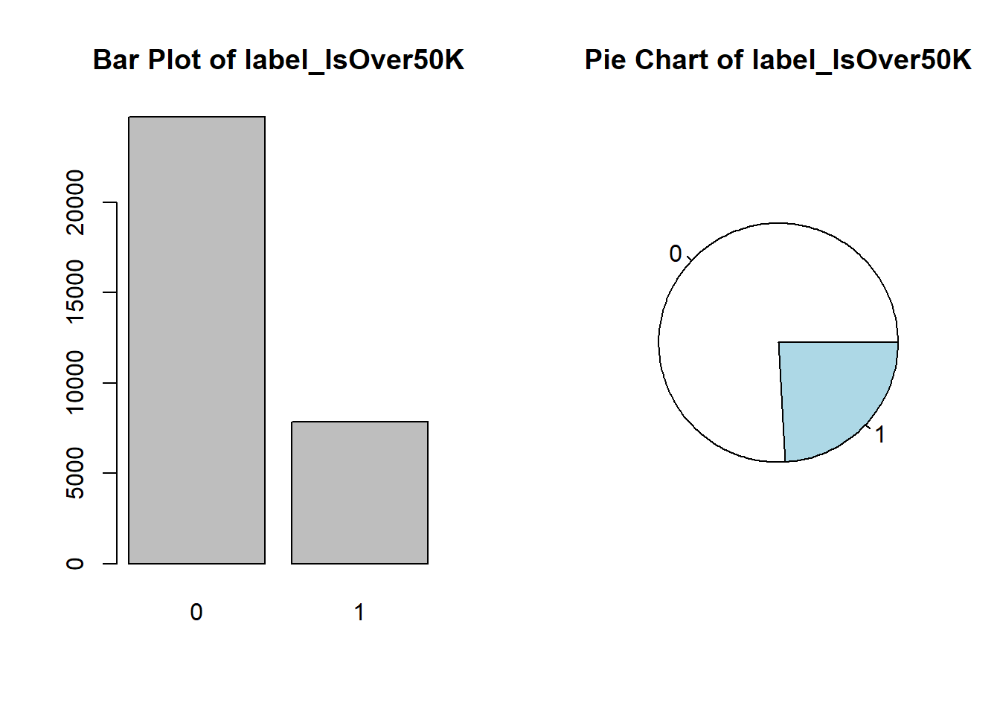

## Visualize the numerical variables

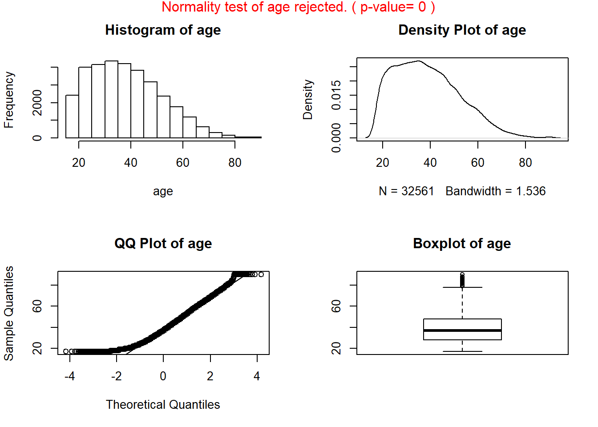

## Visualize the numerical variables

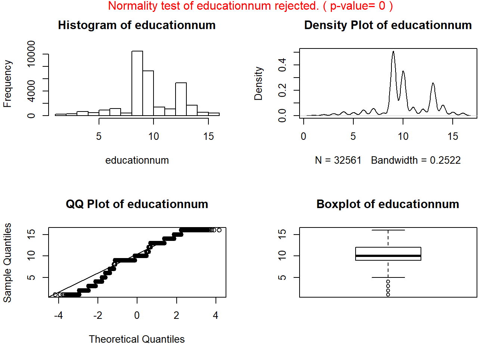

## Visualize the categorical variables

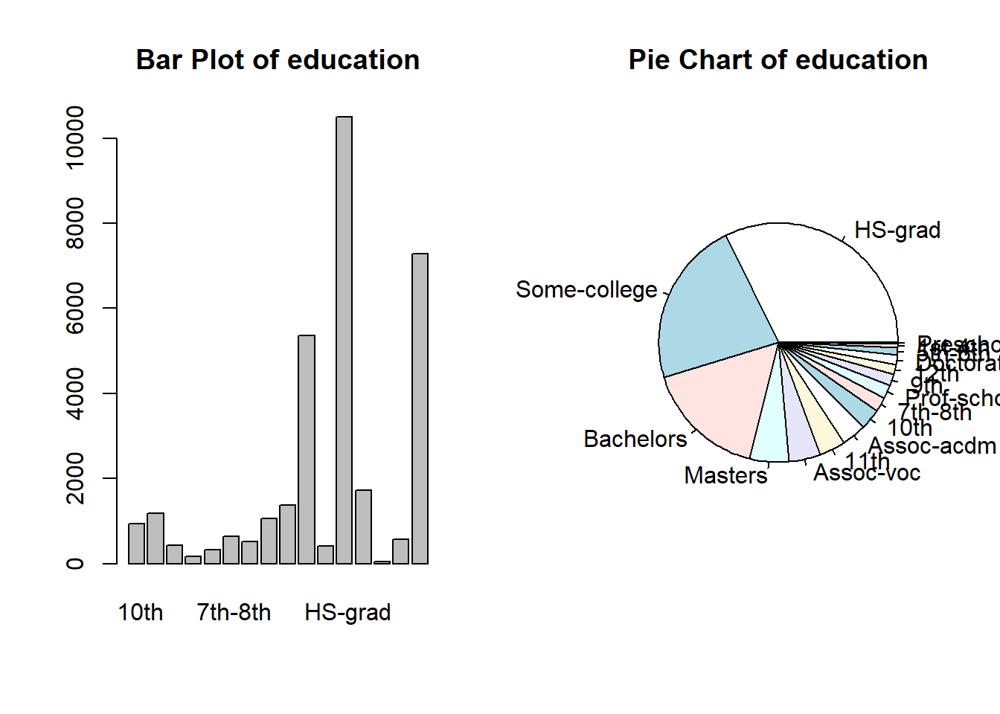

# Investigation on Multiple Variable Interactions
## Rank associated variables
This helps you to understand the top dependent variables (grouped by numerical and categorical) of a variable of your choice.

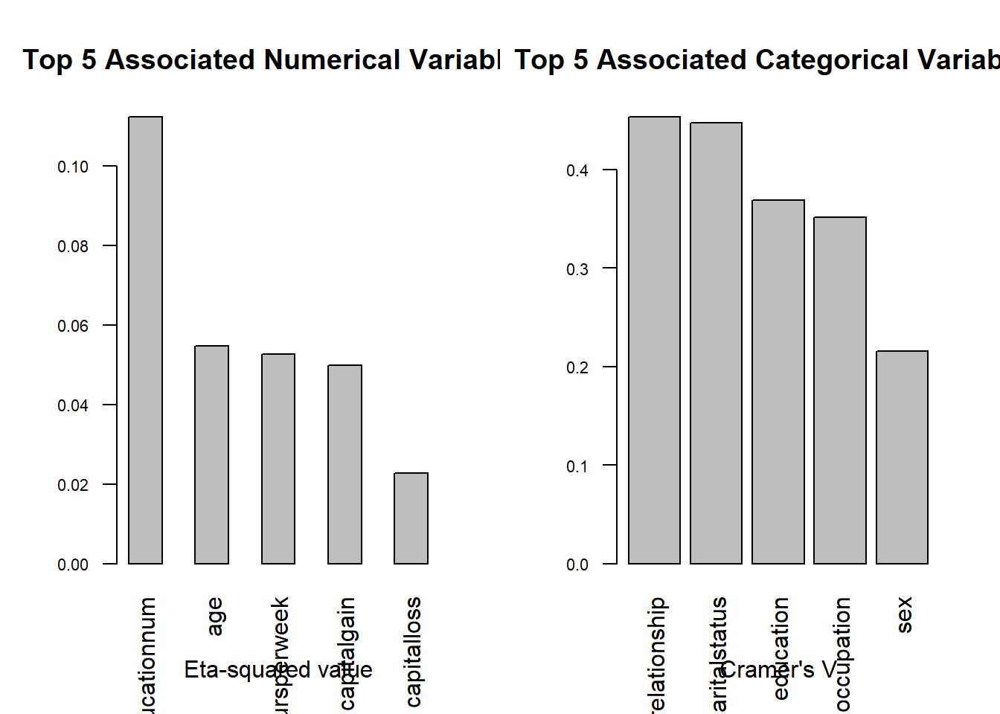

## Visualize interactions between two categorical variables

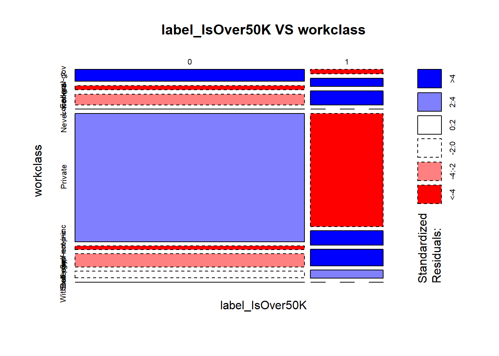

## Calculate the correlations (pearson, kendall, or spearman) between numerical variables

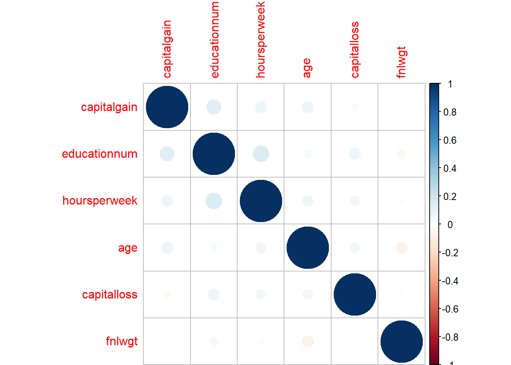

## Visualize interactions between numeric and categorical variables via box plots
X axis is the level of categorical variables. This helps you to understand whether the distribution of the numeric variable is significantly different at different levels #' of the categorical variable. 
We test hypothesis 0 (h0) that the numeric variable has the same mean values across the different levels of the categorical variable. 

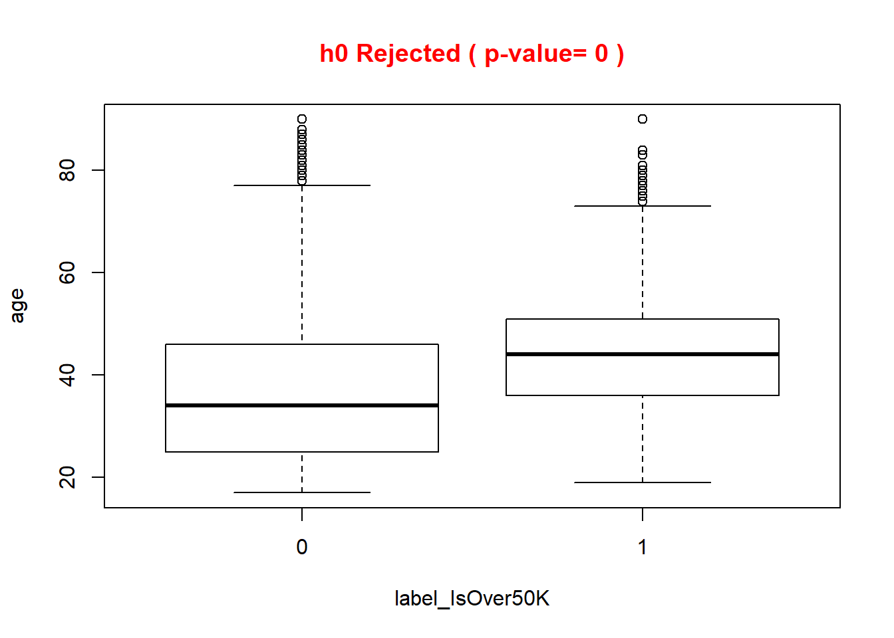

## Visualize interactions between numeric and categorical variables via box plots
X axis is the level of categorical variables. This helps you to understand whether the distribution of the numeric variable is significantly different at different levels #' of the categorical variable. 
We test hypothesis 0 (h0) that the numeric variable has the same mean values across the different levels of the categorical variable. 

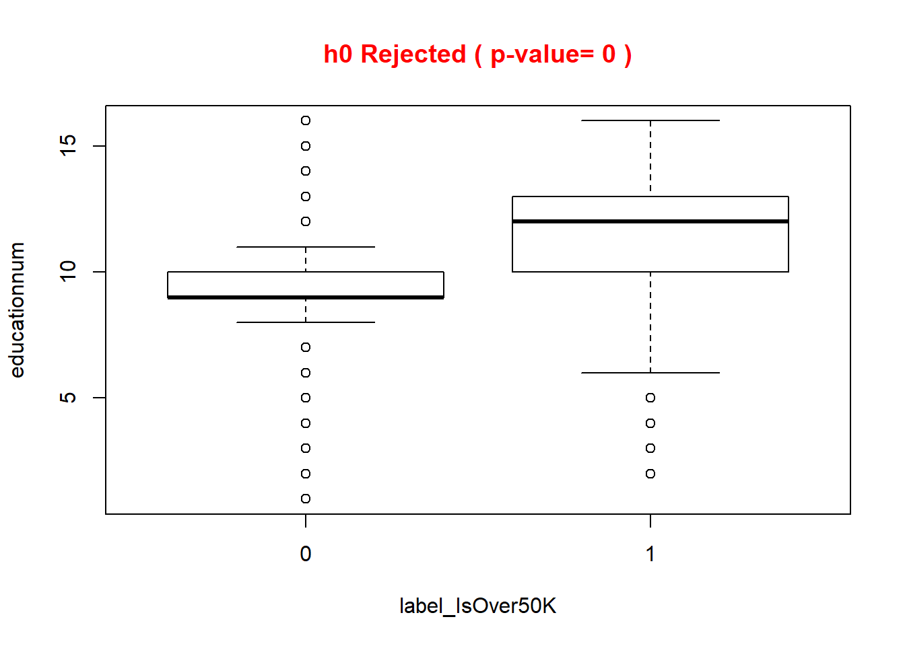

## Project numeric variables to principal components, and visualize

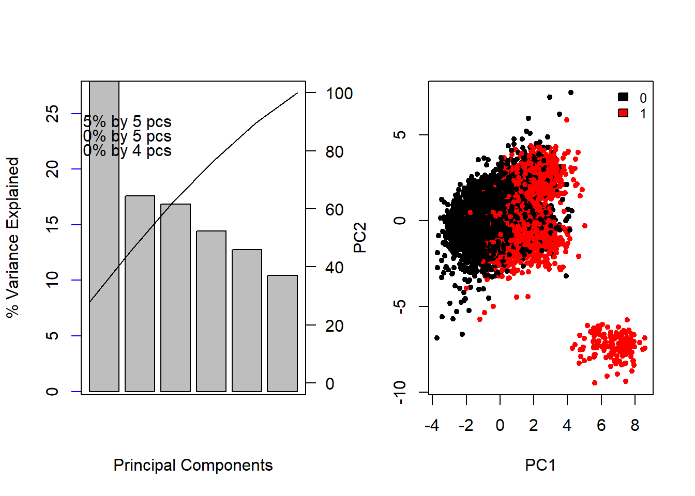

## Project numeric variables to principal components, and visualize

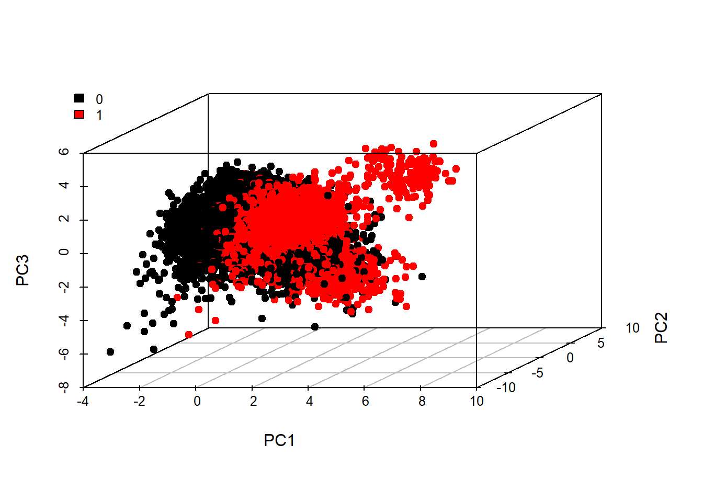

## Project mixture of numerical and categorical variables to 3D principal components, and visualize

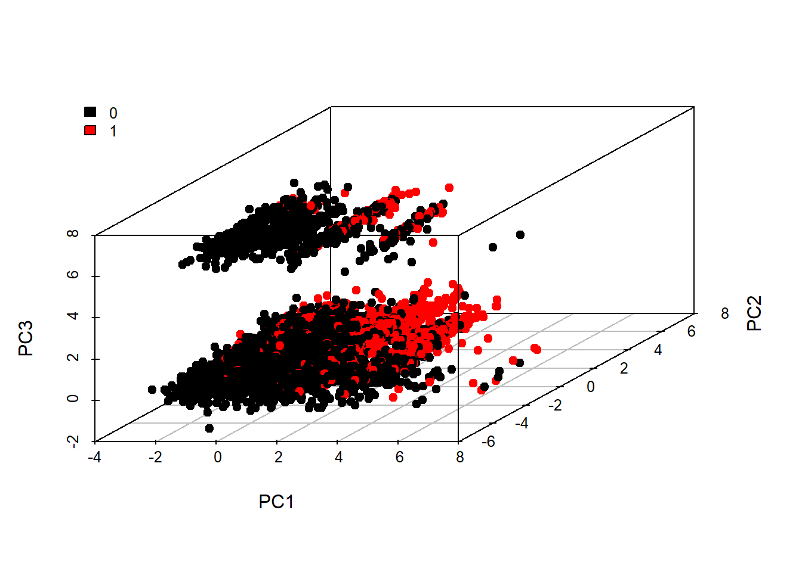


---
title: "adult.log.r"
author: "cweaver"
date: "Tue Sep 26 14:37:36 2017"
---
